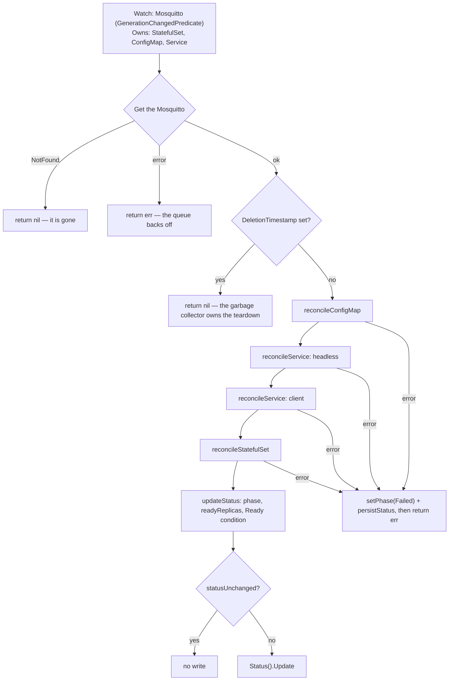

# Developing the Mosquitto Operator

This is the contributor-facing document: what is in the tree, what one reconcile pass does and
why, how to extend the API and the test suites, and what every Make target costs. For what the
operator does for a user, see [README.md](README.md); for the trust boundaries and the privilege
footprint, see [SECURITY_ARCHITECTURE.md](SECURITY_ARCHITECTURE.md); for the reasoning behind the
decisions referenced throughout, see [docs/adr/](docs/adr/).

**State of the project, stated once so nothing below has to hedge.** The operator manages exactly
one kind, `Mosquitto` (`mko.gtrfc.com/v1`), and one pass writes four objects: a ConfigMap, a
headless Service, a client Service and a StatefulSet. There is no webhook, no PodDisruptionBudget,
no NetworkPolicy, no ServiceMonitor, no PrometheusRule and no metrics exporter for the broker.
`cmd/` contains `main.go` and `main_test.go` and nothing else. The broker-metrics exporter is a
recorded decision, not code: see [ADR 0002](docs/adr/0002-the-metrics-exporter-is-written-here.md),
which says so in its own status line.

The unit, integration, image-tools, RBAC-parity and release-tooling tiers were run locally while
this document was written, and the observed results are in
[Section 7](#7-build-test-and-lint-matrix). The **E2E tier was not run** — it needs a Kind cluster
with the operator installed — and I could not establish from the working tree whether any CI run of
it has ever happened. The committed badge, [`.github/badges/coverage.json`](.github/badges/coverage.json),
still carries the placeholder `{"message":"unknown"}` that the first push to `main` overwrites.
Treat every statement about E2E behaviour below as read from the code, not as observed.

---

## 1. Prerequisites

| Tool | Version this repo expects | Where the version lives | Needed for |
|---|---|---|---|
| Go | `1.27.0` | [`go.mod`](go.mod), [`Containerfile`](Containerfile), `GO_VERSION` in both workflows, the badge in [`.github/release-template.hbs`](.github/release-template.hbs) | everything |
| make + bash | any recent | `SHELL = /usr/bin/env bash -o pipefail` in the [`Makefile`](Makefile) | everything |
| Docker | any recent | not pinned | `test-image-tools`, `docker-build`, `kind-*`, `e2e-local` |
| kubectl | CI uses `v1.33.4` | `KUBERNETES_VERSION` in [`.github/workflows/release.yml`](.github/workflows/release.yml) | `install`, `deploy`, `cert-manager-install`, `e2e-local` |
| kind | CI uses `v0.30.0` via `helm/kind-action@v1.14.0` | [`.github/workflows/release.yml`](.github/workflows/release.yml) | `kind-create`, `e2e-local` |
| helm | CI uses `v4.2.4` via `azure/setup-helm@v5` | both workflows | `verify-rbac-parity`, `e2e-local` |
| node + npm | CI uses `lts/*` | [`.github/workflows/release.yml`](.github/workflows/release.yml) | `test-release-tooling`, `verify-ci-references` (node only, no install) |

Everything else installs itself into `bin/` on first use, at a version pinned in the Makefile:

| Binary | Variable | Pinned to |
|---|---|---|
| `kustomize` | `KUSTOMIZE_VERSION` | `v5.8.1` |
| `controller-gen` | `CONTROLLER_GEN_VERSION` | `v0.21.0` |
| `setup-envtest` | `ENVTEST_VERSION` | `release-0.19` (a branch, see below) |
| `golangci-lint` | `GOLANGCI_LINT_VERSION` | `v2.13.2` |
| `gocyclo` | `GOCYCLO_VERSION` | `v0.6.0` |
| `gosec` | `GOSEC_VERSION` | `v2.29.0` |
| `govulncheck` | `GOVULNCHECK_VERSION` | `v1.7.0` |
| `gocovmerge` | `GOCOVMERGE_VERSION` | `v0.0.0-20160331181800-b5bfa59ec0ad` |

Two Makefile properties are worth knowing before you fight one of them:

* **Every tool resolves to `$(LOCALBIN)`, never to `PATH`.** The Makefile comment states the reason
  plainly: a tool picked up from `PATH` silently ignores the pin below it, which is how a gosec
  2.28.0 from Homebrew once ran in place of the pinned `v2.29.0`. If you want to test a newer tool,
  override the variable (`make lint GOLANGCI_LINT=$(which golangci-lint)`), do not rely on `PATH`.
* **The envtest control-plane binaries are a separate download.** `ENVTEST_K8S_VERSION = 1.29.0`
  selects them; they land under `bin/k8s/<version>-<os>-<arch>`. `ENVTEST_VERSION` is pinned to a
  controller-runtime *branch* rather than a tag, so no Renovate datasource resolves it and it is
  bumped by hand alongside `ENVTEST_K8S_VERSION`. It deliberately carries no `# renovate:` comment,
  because a comment that matches nothing is exactly the failure
  [`hack/verify-ci-references.mjs`](hack/verify-ci-references.mjs) exists to catch.

The fastest useful local loop, all four of which run without a cluster and without Docker:

```bash
make lint             # go vet + gofmt -l + golangci-lint
make test-unit        # every untagged test
make test-integration # the real reconciler against envtest
make generate-all     # then check `git status` is clean
```

---

## 2. Repository layout

```text
.
├── api/v1/                              # The mko.gtrfc.com/v1 API group. One kind: Mosquitto.
│   ├── mosquitto_types.go               #   Spec, Status, phase/anti-affinity constants, helpers,
│   │                                    #   and the kubebuilder markers that generate everything.
│   ├── groupversion_info.go             #   GroupVersion, SchemeBuilder, AddToScheme.
│   ├── zz_generated.deepcopy.go         #   GENERATED by `make generate`. Never edit.
│   └── mosquitto_types_test.go
├── cmd/
│   ├── main.go                          # Flags, manager options, reconciler wiring, health checks.
│   └── main_test.go
├── internal/
│   ├── builder/                         # Mosquitto CR -> the Kubernetes objects, pure functions.
│   │   ├── configmap.go                 #   Ports, mount paths, mosquitto.conf generation.
│   │   ├── service.go                   #   Headless and client Service.
│   │   ├── statefulset.go               #   Pod spec, container, PVC template, hash annotations,
│   │   │                                #   and DefaultImage (the pinned broker image).
│   │   └── affinity.go                  #   The off/soft/hard anti-affinity term.
│   ├── common/labels.go                 # Deterministic names and the label sets. Shared vocabulary.
│   └── controller/mosquitto_controller.go  # The reconcile loop, the RBAC markers, the status writer.
├── config/                              # kustomize install path (`make install` / `make deploy`).
│   ├── crd/bases/mko.gtrfc.com_mosquittoes.yaml  # GENERATED by `make manifests`.
│   ├── manager/manager.yaml             # The operator Deployment, hardened to the restricted PSS.
│   └── rbac/                            # role.yaml is GENERATED; everything else is hand-written.
├── deploy/helm/mosquitto-operator/      # Helm install path. The published chart.
│   └── templates/crd.yaml               # GENERATED by `make sync-helm-crd`. Never edit.
├── test/
│   ├── integration/                     # build tag `integration` — envtest: real API server, no kubelet.
│   ├── e2e/                             # build tag `e2e`        — a real cluster, operator via Helm.
│   ├── imagetools/                      # build tag `imagetools` — asks the pinned image what it contains.
│   ├── rbacparity/                      # build tag `rbacparity` — renders both install paths and diffs them.
│   └── testimages/images.go             # No tag. The broker image pin the suites provision.
├── hack/
│   ├── boilerplate.go.txt               # Apache-2.0 header controller-gen stamps on generated files.
│   ├── verify-ci-references.mjs         # Proves every Renovate customManager still matches something.
│   ├── verify-release-tooling.mjs       # Drives the semantic-release plugins over synthetic commits.
│   └── changelog-config.mjs             # Loads .github/release-template.hbs into the notes generator.
├── docs/adr/                            # 0001..0010. Each decision, its evidence and its alternatives.
├── .github/
│   ├── workflows/release.yml            # Every check, plus semantic-release. PR + push to main.
│   ├── workflows/build.yml              # Docker image + Helm chart. On `release: published`.
│   ├── workflows/renovate.yml           # Self-hosted Renovate.
│   ├── release-template.hbs             # The release-notes template. Carries the Go badge.
│   └── badges/coverage.json             # Committed artifact, rewritten by CI on main.
├── Containerfile                        # Two stages: golang:1.27.0-alpine -> distroless static nonroot.
├── Makefile                             # Every entry point. CI enters the repo only through here.
├── renovate.json                        # packageRules + the six customManagers.
├── package.json / .releaserc.json       # semantic-release only. No application JavaScript.
└── .golangci.yml                        # Linters, the revive rule set, the misspell exception.
```

Not in git and safe to delete: `bin/` (installed tools and envtest assets), `coverage/`, `tmp/`
(generated Kind configs), `node_modules/`. All four are in [`.gitignore`](.gitignore), together with
one negation that matters: `!.github/badges/coverage.json`, because the broad `coverage.*` rule
would otherwise keep the committed badge out of a fresh clone.

---

## 3. Package responsibilities

### `api/v1` — the published contract

| File | Responsibility |
|---|---|
| `mosquitto_types.go` | `MosquittoSpec` (`replicas`, `image`, `config`, `antiAffinity`, `tls`, `resources`, `storage`), `MosquittoStatus`, the `Phase*` and `AntiAffinityMode*` constants, `ConditionTypeReady`, and the three helpers `AntiAffinityMode()`, `IsTLSEnabled()`, `IsStorageEnabled()`. The kubebuilder markers here are the only source of the CRD, the print columns and the ClusterRole. |
| `groupversion_info.go` | `GroupVersion{Group: "mko.gtrfc.com", Version: "v1"}`, the `SchemeBuilder`, `AddToScheme`. |
| `zz_generated.deepcopy.go` | Generated. `make generate` rewrites it. |

Two details that read as arbitrary and are not. The resource path is spelled out in the marker
(`+kubebuilder:resource:path=mosquittoes,shortName=mq`) because the generator's own pluralisation of
"Mosquitto" is `mosquittos`, and that name is what RBAC rules, the chart and kubectl all address.
And the helpers fall back to the weakest setting: `AntiAffinityMode()` treats an unknown value as
`off`, `IsTLSEnabled()` treats an empty `secretName` as disabled — so a half-filled spec cannot
produce a listener with no certificate to serve.

### `internal/common` — the shared vocabulary

| Symbol | Responsibility |
|---|---|
| `StatefulSetName`, `HeadlessServiceName`, `ClientServiceName` | The deterministic names: `<name>`, `<name>-headless`, `<name>`. Every managed name is derived from the CR name, which is why the controller checks ownership before writing (Section 4). |
| `BaseLabels(m, image)` | The five labels stamped on every created object, including `app.kubernetes.io/version` derived from the image tag. |
| `SelectorLabels(m)` | The three labels used in selectors. Deliberately excludes the version label: a selector carrying it would stop matching the running pods the moment the image changes, which is exactly when the Service has to keep routing. |
| `ExtractVersionFromImage` | Tag or digest out of an image reference, `latest` when there is neither. Handles a registry port. |
| `MapEntriesMissing(desired, current)` | The label comparison used by every diff. Extra keys in `current` are ignored on purpose: other controllers and users label objects too, and reverting their labels is not this operator's job. |

### `internal/builder` — CR in, objects out

Pure functions. No client, no context, no I/O. That is what lets the unit tier cover them at 99.0%
without a control plane.

| File | Responsibility |
|---|---|
| `configmap.go` | `MQTTPort`/`MQTTSPort` (1883/8883) and their port names, the three mount paths (`/mosquitto/config`, `/mosquitto/tls`, `/mosquitto/data`), the two TLS secret keys, `ConfigMapName`, `BrokerPort`/`BrokerPortName`, `GenerateMosquittoConf` and `BuildConfigMap`. |
| `statefulset.go` | `DefaultImage` (`eclipse-mosquitto:2.1.2-alpine`), `ResolveImage`, `BuildStatefulSet`, the pod spec and container, `buildVolumeClaimTemplates`, `hashOf`, the two hash annotations and `StatefulSetHasChanged`. |
| `service.go` | `BuildHeadlessService` (ClusterIP `None`, `PublishNotReadyAddresses: true`) and `BuildClientService`. Both expose exactly one port, targeted by name. |
| `affinity.go` | `BuildPodAntiAffinity` — `nil` for `off`, a weighted preference for `soft`, a required term for `hard`, both over `kubernetes.io/hostname` and both selecting only this Mosquitto's own pods. |

`BuildStatefulSet` is the only builder that returns an error, and only for an unparsable
`spec.storage.size`: that value reaches the PVC template, which is immutable once created, so a
wrong quantity is worth a visible reconcile failure rather than a silently substituted default.

### `internal/controller` — the loop

| Symbol | Responsibility |
|---|---|
| `MosquittoReconciler` | Holds the client, the scheme and `MaxConcurrentReconciles`. |
| `Reconcile` | One pass: fetch, skip on deletion, write the objects, then update status. On failure it records `Failed` on the resource *and* returns the error, so the failure is visible to `kubectl get` and the work queue still backs off. |
| `reconcileResources` | Dependency order: ConfigMap, headless Service, client Service, StatefulSet. |
| `reconcileConfigMap` / `reconcileService` / `reconcileStatefulSet` | Build, set the controller reference, get, create-or-diff-and-update, refusing any object this CR does not control. |
| `updateStatus`, `setPhase`, `persistStatus`, `statusUnchanged` | The whole status path. `setPhase` writes phase, `observedGeneration` and the `Ready` condition together so the three cannot disagree about which generation they describe. |
| `ensureOwned` | Refuses to write an object this Mosquitto does not control. See [ADR 0009](docs/adr/0009-delete-only-through-owner-references.md). |
| `SetupWithManager` | `For(&Mosquitto{})` with `GenerationChangedPredicate`, plus `Owns` on StatefulSet, ConfigMap and Service. |
| The `+kubebuilder:rbac` markers | The only source of [`config/rbac/role.yaml`](config/rbac/role.yaml). Each verb is justified in a comment above the block, because the role is cluster-wide and an unused cluster-wide verb is blast radius nobody chose. |

### `cmd` — the binary

| Symbol | Responsibility |
|---|---|
| `bindOperatorFlags` | `--metrics-bind-address` (`:8080`), `--health-probe-bind-address` (`:8081`), `--leader-elect` (`false`), `--max-concurrent-reconciles` (`4`). |
| `bindZapFlags` | Registers controller-runtime's zap flags via `zap.Options.BindFlags`, so `--zap-log-level` and friends are accepted. **No shipped Deployment sets one** — the chart passes `--metrics-bind-address`, `--health-probe-bind-address`, `--max-concurrent-reconciles` and `--leader-elect`, and `config/manager/manager.yaml` passes only `--leader-elect`. The deployed operator therefore always runs at the zap defaults (`Development: true`); the flags exist for `make run`, which passes `--zap-log-level=debug`. |
| `managerOptions` | Scheme, metrics address, probe address, leader election with `LeaderElectionID = "mosquitto-operator.mko.gtrfc.com"`. No `LeaderElectionNamespace`, so the Lease lands in the operator's own namespace — which is why the leader-election RBAC is a namespaced `Role`, not a `ClusterRole`. |
| `newReconciler`, `main` | Wiring, `healthz`/`readyz`, `mgr.Start`. |
| `version`, `commit`, `buildTime` | Set via `-ldflags` from the `BUILD_NUMBER`, `GIT_COMMIT` and `BUILD_TIME` build args (see [`Containerfile`](Containerfile)) and logged once at startup. |

Note the split between `main()` and the four small helpers: `main()` itself is untestable (it calls
`ctrl.GetConfigOrDie` and `os.Exit`), so everything decidable was moved out of it. That is why
`cmd` sits at 36.8% coverage while the tested helpers are fully covered — the uncovered part is
`main()` and the error branches that call `os.Exit`.

### `test/*` — one tier per question

| Package | Build tag | Needs | The question only this tier answers |
|---|---|---|---|
| `internal/...`, `api/v1`, `cmd`, `test/testimages` | none | nothing | Does the code compute the right thing? |
| `test/integration` | `integration` | envtest binaries | Does the API server accept what the builder produces, and do the CRD markers actually default and validate as claimed? |
| `test/e2e` | `e2e` | a real cluster + the operator installed | Does a broker come up, speak MQTT, and does deleting the CR really collect everything? |
| `test/imagetools` | `imagetools` | Docker | Does the pinned broker image still contain the binaries this repo executes inside it? |
| `test/rbacparity` | `rbacparity` | helm, kustomize (`bin/kustomize`, else one on `PATH`) and `git rev-parse` | Do both install paths grant the same authority? |

The tiers name their own blind spots in their package comments, and those comments are the contract
between them. `test/integration` states that envtest runs no kube-controller-manager, so garbage
collection is not observable there and the owner-reference proof lives in `test/e2e`. `test/e2e`
states that it imports nothing from `internal/` on purpose — a helper that imported the builder
would agree with a renamed constant by construction and stop being a test of the published
contract. Keep both properties when you add a test.

### `hack/` — the guards

| File | Responsibility |
|---|---|
| `verify-ci-references.mjs` | Walks `renovate.json`, resolves every `managerFilePatterns` entry against the real tree and every `matchStrings` regex against the matched files. Zero matched files, zero matches, or a match that captures no `currentValue` are all failures. Understands `/regex/` and literal paths — **not globs**, and says so instead of passing silently. |
| `verify-release-tooling.mjs` | Runs `@semantic-release/commit-analyzer` and `@semantic-release/release-notes-generator` with the exact plugin config from [`.releaserc.json`](.releaserc.json) over four synthetic commits, and asserts the rendered notes. Exists because a real preset/writer mismatch once turned releases red on `main` while every PR check was green. |
| `changelog-config.mjs` | The conventional-changelog config the notes generator loads: the `conventionalcommits` preset with its main template replaced by `.github/release-template.hbs`. A module rather than a JSON entry because `.releaserc.json` cannot read a file, and inlining the template would leave the `.hbs` unmanaged while Renovate still edits the Go badge inside it. |
| `boilerplate.go.txt` | The Apache-2.0 header `controller-gen object:headerFile=...` stamps onto generated files, which is how `api/v1/zz_generated.deepcopy.go` gets its licence block. |

Both `.mjs` guards are covered by
[ADR 0010](docs/adr/0010-a-check-is-not-a-check-until-it-has-failed-on-purpose.md), which records
the message each one emitted when it was deliberately broken. If you add a guard, add that
observation too — the ADR's D1 is that a guard is trusted only after it has been seen failing
against a deliberately broken input.

### `config/` and `deploy/helm/` — two install paths, one authority

| Path | Generated? | Responsibility |
|---|---|---|
| `config/crd/bases/mko.gtrfc.com_mosquittoes.yaml` | yes (`make manifests`) | The CRD. Single source of truth. |
| `config/rbac/role.yaml` | yes (`make manifests`) | The ClusterRole, from the markers in the controller. |
| `config/rbac/leader_election_role*.yaml` | no | Namespaced Lease + Event permissions. Deliberately *not* in `role.yaml`: no marker produces them, so the next `make generate-all` would delete them. |
| `config/manager/manager.yaml` | no | The operator Deployment. Hardened to the restricted Pod Security Standard; the image is literally named `controller` so `make deploy` can rewrite it with `kustomize edit set image`. |
| `config/default/kustomization.yaml` | no | Namespace `mosquitto-operator-system`, name prefix `mosquitto-operator-`, pulls in `../rbac` and `../manager`. |
| `deploy/helm/mosquitto-operator/templates/crd.yaml` | yes (`make sync-helm-crd`) | The same CRD, concatenated into the chart. |
| `deploy/helm/mosquitto-operator/templates/clusterrole.yaml` | **no** | Hand-written, and therefore the one that can drift. |
| `deploy/helm/mosquitto-operator/templates/leader-election.yaml` | no | The chart mirror of the namespaced leader-election Role, gated on `leaderElection.enabled`. |

The chart's ClusterRole being hand-written while `config/rbac/role.yaml` is generated is the whole
reason `test/rbacparity` exists: a new marker updates one path and silently leaves the other behind,
and neither direction shows up anywhere else, because both are manifests and there is no
compilation step to break. See
[ADR 0006](docs/adr/0006-both-install-paths-grant-the-same-authority.md).

---

## 4. The reconcile pipeline



Step by step, with the reasoning that is not obvious from the code shape:

1. **The watch is narrow on the CR and wide on what it owns.** `For(&Mosquitto{})` carries
   `predicate.GenerationChangedPredicate{}`, so the operator's own status writes do not wake it
   again; changes to the managed objects still arrive through the three `Owns` watches, which is
   how a StatefulSet's readiness reaches `status.readyReplicas` at all.
2. **A missing resource is not an error.** `apierrors.IsNotFound` returns `ctrl.Result{}, nil`.
3. **A resource being deleted is skipped entirely.** There is no finalizer. Owner references make
   the API server's garbage collector delete every managed object, and writing them again during
   deletion would race that collection. This is a decision, not an omission:
   [ADR 0009](docs/adr/0009-delete-only-through-owner-references.md).
4. **Objects are written in dependency order** — ConfigMap, headless Service, client Service,
   StatefulSet — because the pods mount the ConfigMap and are addressed through the headless
   Service.
5. **Every write is create-or-converge, guarded by ownership.** `SetControllerReference`, then
   `Get`, then `Create` on NotFound, then `ensureOwned` before any update. The guard matters most
   for Services: `spec.selector` on a live Service is mutable, so nothing but this check stops the
   operator from pointing a Service somebody else created at these pods. A refusal is reported as a
   reconcile failure, because the resource cannot do its job without the object.
6. **The StatefulSet diff compares hashes, not the pod spec.** `StatefulSetHasChanged` looks at the
   replica count, the object and template labels, and the two annotations
   `mko.gtrfc.com/pod-spec-hash` and `mko.gtrfc.com/config-hash`. A structural comparison against
   the stored object would report a difference on every pass — the API server defaults a long list
   of pod fields the operator never sets — and put the StatefulSet in a permanent update loop.
7. **`volumeClaimTemplates` are written once and never updated.** They are immutable, so writing
   them back would be a no-op or a rejected request. A changed `spec.storage` therefore does not
   converge; the StatefulSet has to be recreated by hand.
8. **Status is recomputed from the live StatefulSet, and written only if it changed.**
   `persistStatus` re-reads the object, compares with `statusUnchanged`, and skips the write
   otherwise. The comparison is not an optimisation: the CR watch already filters status-only
   writes, but every write still costs an API request and a `resourceVersion` bump that every
   informer in the cluster sees.

### What one pass writes

| Object | Name | Built by |
|---|---|---|
| ConfigMap | `<name>-config`, key `mosquitto.conf` | `builder.BuildConfigMap` |
| Headless Service | `<name>-headless`, `ClusterIP: None`, `publishNotReadyAddresses: true` | `builder.BuildHeadlessService` |
| Client Service | `<name>`, ClusterIP | `builder.BuildClientService` |
| StatefulSet | `<name>`, `serviceName: <name>-headless` | `builder.BuildStatefulSet` |
| PVC template | `data`, only when `spec.storage.size` is set | `buildVolumeClaimTemplates` |

The single listener moves rather than multiplies: `BrokerPort` returns 8883/`mqtts` when
`spec.tls` is set and 1883/`mqtt` otherwise, and both Services target the container port *by name*,
so switching TLS on needs no second lookup anywhere.

### Status

| Condition in `updateStatus` | Phase | `Ready` condition | Reason |
|---|---|---|---|
| StatefulSet missing | `Pending` | `False` | `StatefulSetNotFound` |
| `readyReplicas >= spec.replicas` (and `replicas > 0`) | `Ready` | `True` | `AllReplicasReady` |
| `readyReplicas > 0` but fewer than requested | `Progressing` | `False` | `ReplicasNotReady` |
| `readyReplicas == 0` | `Pending` | `False` | `NoReplicasReady` |
| any write in `reconcileResources` failed | `Failed` | `False` | `ReconcileFailed` |

`Failed` describes the operator, not the brokers: pods that were already running keep running.

### How a change actually reaches a running broker

This is the part that catches people. Mosquitto reads its configuration once at startup, and a
ConfigMap update restarts nothing. The `mko.gtrfc.com/config-hash` annotation on the pod template is
what turns a config change into a rollout — without it the new `mosquitto.conf` would sit in the
ConfigMap and never reach a running broker. `mko.gtrfc.com/pod-spec-hash` does the same for changes
the StatefulSet controller would otherwise not notice.

What does **not** propagate on its own:

* **A rotated TLS Secret.** The operator does not watch `spec.tls.secretName`. Replacing the
  certificate changes the Secret, but running pods keep serving the material they started with; the
  rotation takes effect on restart (`kubectl rollout restart statefulset/<name>`). This is stated in
  the field's own doc comment and owned by
  [ADR 0001](docs/adr/0001-the-operator-consumes-tls-material-it-never-issues-it.md).
* **A changed `spec.storage`.** See step 7 above.

---

## 5. Decisions you will trip over

| Decision | Where it lives in code | ADR |
|---|---|---|
| The operator consumes TLS material and never issues it; a rotation needs a pod restart | `MosquittoTLS`, the secret volume in `statefulset.go`, the TLS branch of `GenerateMosquittoConf` | [0001](docs/adr/0001-the-operator-consumes-tls-material-it-never-issues-it.md) |
| The broker metrics exporter will be written here, as a sidecar — not yet implemented | nothing yet; `cmd/` holds only `main.go` | [0002](docs/adr/0002-the-metrics-exporter-is-written-here.md) |
| The Go version is one fact in four files, moved by one grouped Renovate PR | `go.mod`, `Containerfile`, `GO_VERSION` in both workflows, `.github/release-template.hbs` | [0003](docs/adr/0003-the-go-version-is-one-fact-in-four-files.md) |
| Two E2E legs on a node-count axis, no version matrix, and a gate job for branch protection | the `e2e-tests` matrix and `e2e-gate` in `release.yml`, `KIND_WORKERS` in the Makefile | [0004](docs/adr/0004-two-e2e-legs-and-no-version-matrix.md) |
| Fork pull requests execute on the self-hosted runners, gated outside the repository | the comment above `on:` in `release.yml`; no fork guard in the file | [0005](docs/adr/0005-fork-pull-requests-execute-on-the-self-hosted-runners.md) |
| Both install paths grant the same authority, proven by rendering both | `test/rbacparity`, `config/rbac/`, `deploy/helm/.../templates/clusterrole.yaml` | [0006](docs/adr/0006-both-install-paths-grant-the-same-authority.md) |
| One broker image pin, `2.1.2-alpine`, and never an `-openssl` tag | `builder.DefaultImage`, `testimages.MosquittoImage`, the `eclipse-mosquitto` packageRule | [0007](docs/adr/0007-one-broker-image-pin-and-why-not-the-openssl-tag.md) |
| The generated broker accepts anonymous clients, and `spec.config` is appended last | `GenerateMosquittoConf` | [0008](docs/adr/0008-the-generated-broker-is-anonymous-and-spec-config-can-undo-the-rest.md) |
| Delete only through owner references; the generated operator ClusterRole has no `delete` and no `patch` | the markers and `ensureOwned` in the controller | [0009](docs/adr/0009-delete-only-through-owner-references.md) |
| A check is not a check until it has failed on purpose | `hack/*.mjs`, the E2E guard grep, the dirty-tree guards | [0010](docs/adr/0010-a-check-is-not-a-check-until-it-has-failed-on-purpose.md) |

Two more decisions live only in code comments, with no ADR:

* **`MaxConcurrentReconciles` defaults to 4**, not to controller-runtime's 1, because a single
  worker couples every resource in the cluster to the slowest pass. Passes for the *same* resource
  stay serialised at any value, because the work queue never runs two passes for one key. The chart
  exposes it as `maxConcurrentReconciles`.
* **The broker pod runs as uid/gid 1883 with `fsGroup: 1883`**, `runAsNonRoot`,
  `readOnlyRootFilesystem`, all capabilities dropped and the RuntimeDefault seccomp profile — and
  it does not mount a ServiceAccount token, because it issues no API calls. The image entrypoint is
  bypassed (`/usr/sbin/mosquitto -c /mosquitto/config/mosquitto.conf`) precisely because that
  entrypoint chowns `/mosquitto` when it runs as root, which this pod never does.

---

## 6. Extension checklists

### 6.1 Add a field to the CRD

1. Edit [`api/v1/mosquitto_types.go`](api/v1/mosquitto_types.go). Give the field kubebuilder
   validation markers and a doc comment that says **what it does now**, not what a future version
   might do. If it has an on/off notion, add a helper next to `IsTLSEnabled`/`IsStorageEnabled` that
   treats a half-filled value as off.
2. If the field changes what the security posture is, say so in the doc comment. `MosquittoTLS.SecretName`
   is the model: it names both ways of filling the Secret and states plainly that the operator does
   not watch it.
3. Run `make generate-all`. That is `manifests` + `generate` + `sync-helm-crd`, and it rewrites four
   files: `api/v1/zz_generated.deepcopy.go`, `config/crd/bases/mko.gtrfc.com_mosquittoes.yaml`,
   `config/rbac/role.yaml` and `deploy/helm/mosquitto-operator/templates/crd.yaml`.
4. Consume the field in [`internal/builder`](internal/builder). If it affects the pod, confirm it
   lands inside the pod spec that `hashOf` digests — otherwise the change will not roll the pods.
5. Unit-test the builder change. Integration-test defaulting and validation in
   [`test/integration/crd_validation_test.go`](test/integration/crd_validation_test.go) — that tier
   is the only one where the CRD markers are actually enforced by an API server.
6. If the field changes what the broker does at runtime, add an E2E scenario (6.3).
7. Document it in [README.md](README.md) with a `# default` or `# example` marker on the value.
8. Commit the generated files. The `generated-manifests` job runs the generator and fails on a dirty
   tree — and it checks untracked files too, so a newly generated artifact that was never committed
   is caught as well.

### 6.2 Add a builder (a new managed object)

1. New file in [`internal/builder`](internal/builder) with a `BuildX(m *mkov1.Mosquitto) *T`
   function. Keep it pure: no client, no context.
2. Put the object's name in [`internal/common/labels.go`](internal/common/labels.go) next to the
   other name helpers, and label it with `common.BaseLabels(m, ResolveImage(m))` — never with an
   ad-hoc map.
3. Unit-test it. The existing builder tests are the shape: assert the fields you set, and assert the
   fields you deliberately did not.
4. Add a `reconcileX` in
   [`internal/controller/mosquitto_controller.go`](internal/controller/mosquitto_controller.go)
   following the existing five-step shape (build, `SetControllerReference`, `Get`, create on
   NotFound, `ensureOwned` then a semantic diff), and call it from `reconcileResources` in
   dependency order.
5. Diff only the fields the operator owns. If the API server defaults fields on the type, compare a
   hash or a field subset, not the whole object — see step 6 of Section 4 for why.
6. Add the `+kubebuilder:rbac` marker for the new resource, **with a comment justifying every verb**.
   The role is cluster-wide. Do not add `delete` (owner references do that) or `patch` (nothing
   here patches).
7. `make generate-all`, then mirror the new rule into
   [`deploy/helm/mosquitto-operator/templates/clusterrole.yaml`](deploy/helm/mosquitto-operator/templates/clusterrole.yaml)
   by hand, then `make verify-rbac-parity`. The parity test keys on
   `(kind, apiGroup, resource)`, so a namespaced `Role` and a `ClusterRole` with the same verbs are
   correctly *not* the same grant.
8. Add `Owns(&T{})` in `SetupWithManager` if drift on the object should wake the operator.
9. Extend `waitForOwnedObjectsGone` in
   [`test/e2e/mosquitto_test.go`](test/e2e/mosquitto_test.go) so the deletion subtest actually
   proves the new object is collected.

### 6.3 Add an E2E test

1. New file in [`test/e2e`](test/e2e) starting with `//go:build e2e` and `package e2e`.
2. Name it `TestE2E_<Area>_<Behaviour>`. Call `t.Parallel()`.
3. Use `newTestClients(t)` and `tc.createNamespace(t, "e2e-<something>")`. The `e2e-` prefix is not
   cosmetic: the workflow's failure collection greps namespaces matching `^e2e-` for pod logs and
   events. `createNamespace` returns the cleanup function — `defer` it; it keeps the namespace when
   the test failed, so the collection still finds the evidence.
4. Address the API the way a user does: the literals `mko.gtrfc.com/v1`, `Mosquitto`,
   `mosquittoes`, the label keys, the ports. **Do not import `internal/`.** Use
   `testimages.Default()` for the broker image so `E2E_MOSQUITTO_IMAGE` keeps working.
5. Assert something only a real cluster can answer. The readiness probe is a TCP connect, so a
   broker that accepts connections and rejects every CONNECT still reports Ready; the existing
   suite therefore publishes and subscribes with `mosquitto_pub`/`mosquitto_sub` inside the pod.
   If you rely on a new binary from the broker image, add it to `clientTools` in
   [`test/imagetools/image_tools_test.go`](test/imagetools/image_tools_test.go).
6. Never assert on `secret.Data`. testify renders the value it was given, the E2E log is tee'd into
   the job output, and a single red run would publish a private key. Assert on the key set instead —
   `TestE2E_TLS_CertManagerIssuedSecretServesMQTTS` shows the pattern.
7. If the scenario depends on the node count, guard it with `requireThreeSchedulableNodes(t)`, and
   remember that `E2E_REQUIRE_MULTI_NODE=true` turns its skip into a failure on the multi-node leg.
8. If you rename a test that a matrix leg's `run_filter` selects, update the guard grep in the
   `Run E2E tests` step of [`release.yml`](.github/workflows/release.yml). It greps for
   `--- PASS: TestE2E_AntiAffinity_HardSpreadsAcrossNodes` precisely so a filter that stopped
   matching cannot leave the leg green without running anything.
9. Run it: `make e2e-local KIND_WORKERS=0` for a single-node reproduction, or
   `E2E_REQUIRE_MULTI_NODE=true make e2e-local KIND_WORKERS=3 KIND_CLUSTER=mosquitto-operator-test-multinode E2E_RUN=TestE2E_AntiAffinity`
   for the multi-node leg. `e2e-local` creates the cluster, installs cert-manager, builds and loads
   the image, installs the chart and deletes the cluster afterwards.

### 6.4 Add a Renovate-managed pin

1. Put the pin in exactly one place if you can. Where it must exist twice — like the broker image,
   which is both `builder.DefaultImage` and `testimages.MosquittoImage` — add a test that asserts
   the two are equal (`TestPinnedImageIsTheOperatorDefault`) and let one customManager cover both
   files, so they move in one PR.
2. Write the pin with the Renovate comment directly above it, in the form the existing managers
   already match: `# renovate: datasource=go depName=<module path>` above a `TOOL_VERSION ?= vX.Y.Z`
   line in the Makefile, or `// renovate: datasource=docker depName=<image>` above a Go constant, as
   `builder.DefaultImage` and `testimages.MosquittoImage` do.
3. If no existing customManager in [`renovate.json`](renovate.json) covers the file, add one.
   `managerFilePatterns` must be a `/regex/` or a literal path — `hack/verify-ci-references.mjs`
   rejects globs by design rather than passing them silently. Keep `matchStrings` to plain regex
   constructs: Renovate evaluates them with RE2, which rejects lookaround and backreferences that
   Node accepts, and the verifier cannot catch that difference.
4. Add a `packageRule` if the pin must stay on a line (`allowedVersions: "<3"` keeps
   `eclipse-mosquitto` on 2.x) or must be grouped with others (`groupName: "Go version"`).
5. Run `make verify-ci-references`. It prints one `OK:` line per manager with the files and the
   match count — a manager that matched a file zero times is a failure, not a warning.
6. Break it on purpose and watch it fail, then restore it. Record the message it emitted in
   [ADR 0010](docs/adr/0010-a-check-is-not-a-check-until-it-has-failed-on-purpose.md). A guard
   nobody has seen fail is a guard nobody has tested.

---

## 7. Build, test and lint matrix

`make help` prints the target list. Everything CI runs is entered through the Makefile, so the local
and CI invocation are identical.

### The targets a contributor needs

| Target | Needs | Observed cost | What it proves |
|---|---|---|---|
| `lint` | nothing (installs `golangci-lint`) | 3.1 s | `go vet`, `gofmt -l`, and `golangci-lint run --timeout=5m`. Formatting *is* enforced here: the `gofmt` and `goimports` formatters are enabled in [`.golangci.yml`](.golangci.yml), and a misformatted file exits 1 (verified by running `bin/golangci-lint` over a deliberately misformatted probe file, since deleted). |
| `cyclo` | nothing (installs `gocyclo`) | 0.5 s | No function over complexity 15, tests excluded. |
| `gosec` | nothing (installs `gosec`) | 1.4 s | Security scan bounded to `GOSEC_CONCURRENCY=4` / `GOMEMLIMIT=1GiB`, because the unbounded default peaks at ~10 GB on the shared self-hosted runner and gets it OOM-killed. |
| `vuln` | nothing (installs `govulncheck`) | 2.7 s | No known vulnerability reachable from this code. |
| `test-unit` | envtest download on first run | ~7 s uncached (measured on `test-unit-coverage`) | Every untagged test in the module. |
| `test-unit-coverage` | same | 6.7 s uncached | The same, writing `coverage/unit.out`. |
| `test-integration` | envtest binaries | 12.1 s | The real reconciler against a real API server. |
| `test-integration-coverage` | same | not measured | The same, writing `coverage/integration.out` with `-coverpkg=./...`. |
| `test-image-tools` | Docker | 1.9 s warm | The pinned broker image still carries `/usr/sbin/mosquitto` (read out of the builder's container command, not written out again), `mosquitto_pub` and `mosquitto_sub`. First run pulls the image. |
| `verify-rbac-parity` | helm; installs `bin/kustomize` | 2.0 s | Both install paths render the same authority. Must run inside the git worktree — the test locates the repo root with `git rev-parse`. |
| `verify-ci-references` | node (no `npm install`) | 0.4 s | Every Renovate customManager still matches a real file and line. |
| `test-release-tooling` | node + npm (runs `npm ci`) | 2.9 s | The semantic-release plugin set still renders release notes. |
| `generate-all` | nothing (installs `controller-gen`) | 4.1 s | CRD, DeepCopy, ClusterRole and the chart CRD regenerated. Follow it with `git status`. |
| `build` | nothing | 2.4 s | `bin/manager`. Runs `fmt` and `vet` first — note `fmt` rewrites files in place. |
| `docker-build` | Docker | 5.5 s warm | The operator image. Depends on `generate-all`, so it regenerates first. A cold build downloads the module graph. |
| `test-e2e` | a running cluster with the operator installed | **not run** | The provisioning, TLS and anti-affinity scenarios. |
| `e2e-local` | Docker + kind + kubectl + helm | **not run** | Creates the cluster, installs cert-manager, builds and loads the image, installs the chart, runs `test-e2e`, deletes the cluster. |

### What was actually run

Run on macOS (Apple Silicon, `go1.27.0 darwin/arm64`) with warm module and build caches, while
writing this document. Times are wall clock from `time`, so they are a lower bound — a cold clone
pays for the tool downloads, the envtest assets and the broker image pull on top.

| Command | Result |
|---|---|
| `make help` | prints the grouped target list |
| `make test-unit` | all 6 packages pass (from the Go test cache) |
| `make lint` | `0 issues.` |
| `make cyclo` | `All functions are below complexity threshold 15` |
| `make gosec` | `Files: 11  Lines: 1623  Nosec: 0  Issues: 0` |
| `make vuln` | `No vulnerabilities found.` |
| `GOFLAGS=-count=1 make test-unit-coverage` | all 6 packages pass — `api/v1` 90.0%, `cmd` 36.8%, `internal/builder` 99.0%, `internal/common` 100.0%, `internal/controller` 91.9%, `test/testimages` 100.0% |
| `make test-integration` | 12 tests pass, `ok ... 9.096s` |
| `make test-image-tools` | 2 tests pass against `eclipse-mosquitto:2.1.2-alpine` |
| `make verify-rbac-parity` | pass |
| `make verify-ci-references` | `OK: all 6 Renovate customManagers reference real files and lines` |
| `make test-release-tooling` | `OK: release tooling renders release notes` — `analyzeCommits -> major`, `generateNotes -> 1450 chars, all sections present` |
| `make generate-all` | no change to the working tree |
| `make build` | `bin/manager` written |
| `make docker-build IMG=mosquitto-operator:doccheck` | image built (and removed again afterwards) |

Not run, and therefore not claimed to work: `test`, `test-coverage`, `coverage`, `coverage-ci`,
`coverage-merge`, `coverage-json`, `test-integration-coverage`, `lint-fix`, `run`, `test-e2e`,
`e2e-local`, `kind-create`, `kind-delete`, `kind-load`, `cert-manager-install`, `docker-push`,
`docker-buildx`, `install`, `uninstall`, `deploy`, `undeploy`.

### Coverage plumbing

Two different pipelines produce a coverage number, and they do not agree on the badge colours:

* **Locally**, `coverage-merge` runs `gocovmerge` over `coverage/unit.out` and
  `coverage/integration.out` into `combined.out`/`combined.txt`, and `coverage-json` turns that into
  the badge JSON with thresholds 80/60/40/20 (brightgreen/green/yellow/orange, else red) using `bc`.
* **In CI**, the `coverage-report` job never calls those targets. It downloads the two artifacts,
  concatenates the profiles inline, and computes the badge in Python with thresholds
  90/80/70/60. It also deduplicates blocks by location before aggregating per package, because the
  concatenation makes every block both runs touched appear twice and `mode: set` means covered-by-either.

So a badge produced by `make coverage-json` can be a different colour than the one CI writes for the
same percentage. The badge in `main` is always the CI one; the Makefile pair is for local use.

<details>
<summary>Full Make target reference</summary>

**General** — `help` (the target list), `all` (aliases `build`).

**Development** — `fmt` (`gofmt -s -w .`, rewrites in place), `vet`, `lint`, `lint-fix`, `cyclo`,
`cyclo-report` (`gocyclo -top 20 .`, including tests), `test` (`fmt vet envtest` then
`go test ./... -coverprofile cover.out` — note the profile lands at the repo root, not in
`coverage/`), `test-unit`, `test-unit-coverage`, `test-integration`, `test-integration-coverage`,
`test-e2e`, `test-image-tools`, `test-release-tooling`, `verify-ci-references`,
`verify-rbac-parity`, `test-coverage`, `coverage`, `coverage-ci`, `coverage-merge`, `coverage-json`.

**Kind / E2E** — `kind-create` (control-plane + `KIND_WORKERS` workers), `kind-delete`, `kind-load`
(builds and loads `IMG`), `cert-manager-install` (applies cert-manager `v1.17.2` and the
self-signed ClusterIssuer chain from `test/e2e/testdata/`), `e2e-local`.

**Security** — `gosec`, `vuln`.

**Code generation** — `manifests` (controller-gen `rbac:roleName=mosquitto-operator-role crd`, then
`sync-helm-crd`), `generate` (DeepCopy), `sync-helm-crd`, `generate-all`.

**Build** — `build`, `run` (`go run ./cmd/main.go --zap-log-level=debug` against your kubeconfig),
`docker-build`, `docker-push`, `docker-buildx` (amd64 + arm64, pushes).

**Deployment** — `install` / `uninstall` (CRD first, then the RBAC; reverse on the way out —
and removing the CRD deletes every `Mosquitto` in the cluster along with the broker workloads they
own), `deploy` / `undeploy`.

**Variables worth overriding**

| Variable | Default | Effect |
|---|---|---|
| `IMG` | `guidedtraffic/mosquitto-operator:latest` | image built/pushed/loaded |
| `E2E_IMG` | `mosquitto-operator:test` | image `e2e-local` builds and loads |
| `KIND_CLUSTER` | `mosquitto-operator-test` | cluster name |
| `KIND_WORKERS` | `3` | worker nodes `kind-create` adds. The worker lines come from a counting loop rather than `seq`, because BSD `seq 1 0` counts *down* and would build a two-worker cluster for `KIND_WORKERS=0` |
| `E2E_RUN` | empty | `-run` filter for `test-e2e` |
| `E2E_MOSQUITTO_IMAGE` | empty | broker image the E2E suite provisions; empty uses the pin in `test/testimages/images.go` |
| `CYCLO_THRESHOLD` | `15` | complexity gate |
| `GOSEC_CONCURRENCY` / `GOSEC_MEMLIMIT` | `4` / `1GiB` | the OOM bound described above |
| `ignore-not-found` | `false` | passed to `kubectl delete` by `uninstall`/`undeploy` |

**One caveat about `make deploy`:** it runs `kustomize edit set image controller=$(IMG)` inside
`config/manager/`, which edits `config/manager/kustomization.yaml` in place. Revert that before
committing, or the `generated-manifests` job will fail on a dirty tree. (Read from the target; not
executed.)

</details>

---

## 8. CI and release

Everything runs on `runs-on: self-hosted`. That is a deliberate, recorded exposure: this repository
is public, so a fork pull request executes fork-authored code on that infrastructure. Repository
secrets are *not* passed to a fork run — GitHub provides only a read-only `GITHUB_TOKEN` — so the
exposure is code execution on the runner, not disclosure of `DOCKERHUB_PAT` or `BOT_PAT`. It is
gated outside the repository, under Settings > Actions > General, and there is deliberately no fork
guard in the workflow. See
[ADR 0005](docs/adr/0005-fork-pull-requests-execute-on-the-self-hosted-runners.md).

### On a pull request and on every push to `main`

[`.github/workflows/release.yml`](.github/workflows/release.yml), concurrency-grouped per ref with
`cancel-in-progress: true`, top-level `permissions: contents: read`.

| Job | Runs | Notes |
|---|---|---|
| `E2E Tests (single-node)` / `E2E Tests (multi-node)` | the two matrix legs | 0 and 3 workers, distinct cluster names, `fail-fast: false`. The multi-node leg runs with `E2E_RUN=TestE2E_AntiAffinity` and `E2E_REQUIRE_MULTI_NODE=true`. |
| `E2E Tests` (`e2e-gate`) | `needs: [e2e-tests]`, `if: always()` | The stable status context for branch protection. A matrix leg's context name changes whenever the leg is renamed; this one does not. |
| `Code Linting` | `make lint` | |
| `GoSec Security Scan` | `make gosec` | 15 min job timeout, 10 min step timeout. |
| `Malware Scan (Source Code)` | ClamAV over the tree | Uploads the report for 30 days. |
| `Container Malware Scan` | `needs: [malware-scan]` | Builds the image, **logs out of Docker Hub**, then runs Trivy twice (table with `exit-code: 1`, then SARIF). Trivy is pinned to a commit SHA because it used to track a moving `master` two steps after a registry login. |
| `Unit Tests` | `make test-unit-coverage` | Uploads `coverage/unit.out`. |
| `Integration Tests (envtest)` | `make test-integration-coverage` | Uploads `coverage/integration.out`. |
| `Combined Coverage Report` | `needs: [unit-tests, integration-tests]` | Merges, writes the step summary and a sticky PR comment with the per-package table and the diff against `main`'s badge. On a push to `main` it writes and uploads the badge artifact. |
| `Mosquitto Image Tools` | `make test-image-tools` | Logs in to Docker Hub first, because it pulls the pinned broker image on every run. |
| `Vulnerability Check` | `make vuln` | |
| `Cyclomatic Complexity` | `make cyclo` | Also writes a top-20 report into the job summary. |
| `Generated Manifests Up To Date` | `make generate-all` + dirty check + `make verify-rbac-parity` | The dirty check covers untracked files too. |
| `Release Tooling` | `make verify-ci-references`, `npm ci --ignore-scripts`, `npm audit signatures`, `node hack/verify-release-tooling.mjs` | It calls the node script directly rather than `make test-release-tooling`: the install here is explicit and uses `npm ci --ignore-scripts`, where the Makefile target runs `npm ci --no-audit --no-fund`. |
| `Semantic Release` | `if: push && ref == refs/heads/main`, `needs:` the thirteen check jobs — every row above except `e2e-gate`, with `e2e-tests` itself in the list | `npx semantic-release` with `BOT_PAT`. |

The E2E job carries a long preparation sequence that exists for real, still-applicable mechanics of
Docker-in-Docker runners, and it is worth reading before you touch it: kernel modules and sysctls
for kube-proxy's iptables mode; per-node inotify limits, because since Linux 5.13 those are
user-namespace-aware and host settings are not inherited; a resilient DaemonSet wait that collects
logs and deletes crash-looping pods; and an in-cluster connectivity probe that restarts kube-proxy
when the ClusterIP DNAT rules have not landed yet, because kube-proxy being Ready does not mean its
rules are applied. It also preloads the operator image and the pinned broker image into every Kind
node with `ctr`, reading the broker tag out of `test/testimages/images.go` rather than repeating it —
a second copy that lagged would preload an image the suite no longer provisions, which looks exactly
like a working cache.

`semantic-release` derives the version from Conventional Commits, publishes the GitHub release, and
commits `.github/badges/coverage.json` with the message
`chore(release): ${version} [skip ci]` (see [`.releaserc.json`](.releaserc.json)).

### On a published release

[`.github/workflows/build.yml`](.github/workflows/build.yml), serialised by a workflow-wide
concurrency group with `cancel-in-progress: false`, because two runs would both rebase the same
`gh-pages` `index.yaml`.

1. **`Build Docker Image`** — buildx builds `linux/amd64` (the arm64 platform is commented out) and
   pushes to `guidedtraffic/mosquitto-operator` with `provenance: true` and `sbom: true`; uploads an
   SPDX SBOM to the release; runs Docker Scout. The tag set comes from `docker/metadata-action`:
   `{{version}}`, `{{major}}.{{minor}}`, `{{major}}` and the commit sha. Its `latest` entry is gated
   on `github.ref == refs/heads/main`, which a `release: published` run never matches, so this
   workflow does not move `latest`. The checkout uses
   `persist-credentials: false` because the Containerfile does `COPY . .` — and `.dockerignore`
   excludes `.git/` as well, both halves, because either one alone is a single point of failure.
2. **`Release Helm Chart to GitHub Pages`** — `needs: build`. Regenerates and fails on a dirty tree
   (the same guard as `generated-manifests`, so the released chart cannot carry a stale CRD), stamps
   the release version into `Chart.yaml` and `values.yaml`, packages, merges the repo index, and
   pushes to `gh-pages`. The push is deliberately **not** forced: a non-fast-forward rejection means
   somebody published in between, and failing is the correct outcome.

### Renovate

[`.github/workflows/renovate.yml`](.github/workflows/renovate.yml) runs self-hosted Renovate daily
at 02:00 Europe/Berlin (the `timezone` key is what makes that true — without it GitHub reads cron as
UTC), on every push to `main`, and on demand. Automerge policy from
[`renovate.json`](renovate.json): minor, patch and digest updates automerge after CI; every major
update is labelled `major-update` and waits for a human, and major updates of *indirect* Go modules
are disabled outright, because a module-path bump cannot be applied without a direct importer and
`go mod tidy` would keep resetting it. GitHub Actions majors specifically are read
before they merge, because those actions execute on the self-hosted runners inside jobs that hold
`DOCKERHUB_PAT` and `BOT_PAT`.

---

## 9. Conventions

* **English everywhere** — code, comments, commit messages, documentation.
* **Conventional Commits.** `semantic-release` derives the version from them
  (`@semantic-release/commit-analyzer` with the `conventionalcommits` preset). Renovate is
  configured to use `fix` for dependency updates and `chore` for GitHub Actions bumps, so its PRs
  land in the right release-notes section.
* **Comments explain why, never what.** The Makefile and the workflows carry long comments about
  DinD kernel modules, the inotify limits, the kube-proxy iptables race, the 131072-byte `with:`
  cap, the gosec memory bound and the guard greps. Keep them accurate: a comment describing
  machinery this repo does not have is worse than no comment.
* **Generated files are never edited by hand.** `api/v1/zz_generated.deepcopy.go`,
  `config/crd/bases/`, `config/rbac/role.yaml` and
  `deploy/helm/mosquitto-operator/templates/crd.yaml` all come from `make generate-all`, and CI
  fails if the checked-in copies differ.
* **One build tag per test tier**, and each tier states its own blind spot in its package comment.
  A test that can run without a cluster belongs in a tier that runs on the pull request.
* **No `-short` gate anywhere.** The Makefile comment says why: CI runs the coverage targets, so a
  `testing.Short()` gate would remove the tests behind it from every automated run while they still
  pass locally.
* **Deterministic names live in `internal/common`**, label sets included. A builder that invents a
  name inline is a name no other package can find.
* **New dependencies are justified.** `cert-manager` appears nowhere in `go.mod` or `go.sum`, and
  the E2E suite talks to it through the dynamic client as unstructured objects precisely to keep it
  that way. (`prometheus/client_golang` is in the graph, but only as an indirect dependency of
  controller-runtime's metrics server — nothing in this repo registers a metric of its own.)
* **A new guard is proven by breaking it**, and the message it emitted is recorded in
  [ADR 0010](docs/adr/0010-a-check-is-not-a-check-until-it-has-failed-on-purpose.md).
* **A decision that a future reader would otherwise re-litigate gets an ADR** in
  [docs/adr/](docs/adr/), numbered sequentially, with its evidence, its alternatives and its
  residual risks.

---

## 10. Where to look next

| Document | What it answers |
|---|---|
| [README.md](README.md) | What the operator does, the CRD reference, install and upgrade. |
| [SECURITY_ARCHITECTURE.md](SECURITY_ARCHITECTURE.md) | Trust boundaries, the privilege footprint, where credentials live, residual risks. |
| [docs/adr/](docs/adr/) | Why each of the ten load-bearing decisions was made, and what was rejected. |
| [Makefile](Makefile) | The authoritative list of entry points; `make help` prints it. |
| [.github/workflows/release.yml](.github/workflows/release.yml) | Every check that gates a merge, in the order CI runs them. |
