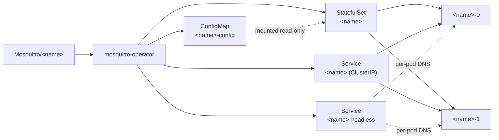

# Mosquitto Operator

[](https://github.com/guided-traffic/mosquitto-operator/actions)
[](https://github.com/guided-traffic/mosquitto-operator)
[](https://goreportcard.com/report/github.com/guided-traffic/mosquitto-operator)
[](LICENSE)

A Kubernetes operator that turns one `Mosquitto` custom resource into an
[Eclipse Mosquitto](https://mosquitto.org/) deployment: a StatefulSet of broker pods, a
ConfigMap carrying the generated `mosquitto.conf`, a headless Service that gives every pod a
DNS name, and a ClusterIP Service in front of all of them — with optional per-pod
persistence, optional pod anti-affinity and an optional TLS listener. The broker pods are
**independent Mosquitto processes behind one Service**: there is no bridging between them, no
shared session state, no shared retained messages and no clustering. Raising `spec.replicas`
buys process redundancy, not a highly available broker. Highly available brokers are the goal
of this project; this version does not deliver them.



Every claim in this document was verified by reading this repository. What was **not** done:
running any of it against a real Kubernetes cluster. This tree is greenfield — two commits on `feat/initial-build` and
an uncommitted working tree — so the E2E suite in [`test/e2e/`](test/e2e/) that exercises the
provisioning path in CI has no observed run to point at. Commands below are transcribed from
the code and from that suite; the ones that need no cluster were executed while writing this
file.

## ✨ Key Features

- 🦟 **One resource, four objects** — a `Mosquitto` produces a StatefulSet, a ConfigMap, a headless Service and a ClusterIP Service, all carrying its owner reference.
- 🧾 **Generated `mosquitto.conf`** — logging to stdout, persistence into `/mosquitto/data/`, one listener, and your own directives from `spec.config` appended verbatim.
- ♻️ **Config changes reach running pods** — the rendered configuration is hashed into a pod-template annotation, so a ConfigMap edit rolls the StatefulSet instead of sitting unread.
- 🔐 **Optional MQTTS** — `spec.tls.secretName` mounts an existing `tls.crt`/`tls.key` Secret and moves the listener to 8883. The operator consumes TLS material; it never issues or renews it.
- 💾 **Optional persistence** — `spec.storage` renders a `data` PVC template; without it the persistence directory is an `emptyDir` at the same path.
- 🧭 **Opt-in anti-affinity** — `off` (default), `soft` (scheduler preference) or `hard` (one broker pod per node, surplus pods stay `Pending`), over `kubernetes.io/hostname`.
- 🛡 **Never adopts what it does not own** — an existing ConfigMap, Service or StatefulSet under a managed name is refused, not overwritten, and reported on the resource.
- 🗑 **No delete verb** — the ClusterRole grants none, so teardown runs entirely through owner references and the garbage collector.
- 🔒 **Hardened broker pods** — non-root uid/gid 1883, read-only root filesystem, all capabilities dropped, `seccompProfile: RuntimeDefault`, no ServiceAccount token mounted.
- 📊 **Status you can read with `kubectl`** — `PHASE`, `READY` and `REPLICAS` printer columns, `observedGeneration`, and a `Ready` condition.
- 📦 **Two install paths, one authority** — Helm chart and `kustomize build config/default`; [`make verify-rbac-parity`](Makefile) compares what they actually render.

## 📛 Naming conventions

Everything below is derived deterministically from the resource. For a `Mosquitto` named
`<name>` in namespace `<ns>`:

### Objects

| Object | Name | Defined in |
|---|---|---|
| StatefulSet | `<name>` | [`common.StatefulSetName`](internal/common/labels.go) |
| Headless Service | `<name>-headless` | [`common.HeadlessServiceName`](internal/common/labels.go) |
| Client Service (ClusterIP) | `<name>` | [`common.ClientServiceName`](internal/common/labels.go) |
| ConfigMap | `<name>-config` | [`builder.ConfigMapName`](internal/builder/configmap.go) |
| ConfigMap key | `mosquitto.conf` | [`builder.ConfigKey`](internal/builder/configmap.go) |
| Broker container | `mosquitto` | [`builder.BrokerContainerName`](internal/builder/statefulset.go) |
| Volumes | `config`, `tls` (only with `spec.tls`), `data` | [`builder.ConfigVolumeName`, `TLSVolumeName`, `DataVolumeName`](internal/builder/statefulset.go) |
| PVC template (only with `spec.storage`) | `data` | [`builder.DataVolumeName`](internal/builder/statefulset.go) |

Kubernetes derives two more names from those, by its own StatefulSet rules rather than by
anything in this repository: the pods are `<name>-0 … <name>-(replicas-1)`, and a PVC template
named `data` produces `data-<name>-<ordinal>`.

### Addresses

| What | Address | Port |
|---|---|---|
| Client Service | `<name>.<ns>.svc.cluster.local` | `1883`, or `8883` with `spec.tls` |
| One specific pod | `<name>-<ordinal>.<name>-headless.<ns>.svc.cluster.local` | same |

Both follow from the Service names above and from `spec.serviceName: <name>-headless` on the
StatefulSet; the cluster domain is whatever the cluster uses, `cluster.local` by default.

### Ports and paths

| Thing | Value | Defined in |
|---|---|---|
| Plain MQTT port / port name | `1883` / `mqtt` | [`builder.MQTTPort`, `MQTTPortName`](internal/builder/configmap.go) |
| MQTTS port / port name | `8883` / `mqtts` | [`builder.MQTTSPort`, `MQTTSPortName`](internal/builder/configmap.go) |
| Config mount | `/mosquitto/config` (read-only) | [`builder.ConfigMountPath`](internal/builder/configmap.go) |
| TLS mount | `/mosquitto/tls` (read-only) | [`builder.TLSMountPath`](internal/builder/configmap.go) |
| Data mount / persistence location | `/mosquitto/data` | [`builder.DataMountPath`](internal/builder/configmap.go) |
| Expected Secret keys | `tls.crt`, `tls.key` | [`builder.TLSCertKey`, `TLSKeyKey`](internal/builder/configmap.go) |
| Broker command | `/usr/sbin/mosquitto -c /mosquitto/config/mosquitto.conf` | [`buildBrokerContainer`](internal/builder/statefulset.go) |

Exactly one container port is declared: `mqtt` or `mqtts`, never both. Enabling TLS **moves**
the generated listener rather than adding one.

### Labels and annotations

| Key | Value | On |
|---|---|---|
| `app.kubernetes.io/name` | `mosquitto` | every created object, and in every selector |
| `app.kubernetes.io/instance` | `<name>` | every created object, and in every selector |
| `app.kubernetes.io/managed-by` | `mosquitto-operator` | every created object, and in every selector |
| `app.kubernetes.io/component` | `broker` | every created object (**not** in selectors) |
| `app.kubernetes.io/version` | the image tag, or `latest` when the image carries none | every created object (**not** in selectors) |
| `mko.gtrfc.com/pod-spec-hash` | 8 hex digits over the built pod spec | the pod template |
| `mko.gtrfc.com/config-hash` | 8 hex digits over the generated `mosquitto.conf` | the pod template |

The selector deliberately omits `component` and `version`
([`common.SelectorLabels`](internal/common/labels.go)): a selector carrying the image tag
would stop matching the running pods exactly when the image changes and the Service has to
keep routing.

The two annotations are how a change the StatefulSet controller would otherwise not see
becomes part of the pod template. Mosquitto reads its configuration once at startup and a
ConfigMap update restarts nothing, so `mko.gtrfc.com/config-hash` is what turns a config edit
into a rollout.

### Operator install

| Object | Helm (`helm install mosquitto-operator …`) | kustomize (`config/default`) |
|---|---|---|
| Deployment | `mosquitto-operator` | `mosquitto-operator-mosquitto-operator` |
| ServiceAccount | `mosquitto-operator` | `mosquitto-operator-mosquitto-operator` |
| ClusterRole | `mosquitto-operator` | `mosquitto-operator-mosquitto-operator-role` |
| ClusterRoleBinding | `mosquitto-operator` | `mosquitto-operator-mosquitto-operator` |
| Leader-election Role / RoleBinding | `mosquitto-operator-leader-election` | `mosquitto-operator-mosquitto-operator-leader-election` |
| Metrics Service | `mosquitto-operator-metrics` | *(none — the kustomize path renders no Service)* |
| Namespace | whatever `--namespace` says | `mosquitto-operator-system` (fixed in [`config/default/kustomization.yaml`](config/default/kustomization.yaml)) |

The kustomize names repeat themselves because `config/default` sets
`namePrefix: mosquitto-operator-` over resources already named `mosquitto-operator`. The
Helm names above are for the release name `mosquitto-operator`; another release name changes
them through the chart's `fullname` template. The **names** differ between the two paths, the
**rules** do not — that is what `make verify-rbac-parity` compares.

| Thing | Value |
|---|---|
| API group / version / kind | `mko.gtrfc.com` / `v1` / `Mosquitto` |
| Resource / short name | `mosquittoes` / `mq` |
| CRD | `mosquittoes.mko.gtrfc.com` |
| ClusterRole name from the markers | `mosquitto-operator-role` |
| Leader-election Lease | `mosquitto-operator.mko.gtrfc.com`, in the operator's namespace |
| Operator image | `guidedtraffic/mosquitto-operator` |
| Default broker image | `eclipse-mosquitto:2.1.2-alpine` |

## 📚 Documentation

| Document | What it covers |
|---|---|
| [DEVELOPER.md](DEVELOPER.md) | Repository layout, per-package responsibilities, the reconcile pipeline, how to add a field, the build/test/lint matrix and the release process |
| [SECURITY_ARCHITECTURE.md](SECURITY_ARCHITECTURE.md) | Trust boundaries, every RBAC rule and what it permits, where the TLS material lives, what the isolation does **not** cover, and the hardening checklist |
| [docs/adr/](docs/adr/README.md) | Architecture Decision Records — what was decided, why, what was rejected and what it costs |
| [Full reference](#-full-reference) (below) | Every `spec` field, its default and its effect |
| [Eclipse Mosquitto documentation](https://mosquitto.org/documentation/) | Upstream broker behaviour and every `mosquitto.conf` option `spec.config` can carry |
| [cert-manager](https://cert-manager.io/docs/) | Optional, and never installed by this project — one of the two ways to fill the Secret `spec.tls.secretName` names |

Read [SECURITY_ARCHITECTURE.md](SECURITY_ARCHITECTURE.md) before granting anyone
`create mosquittoes`: the generated broker accepts anonymous clients, and the operator holds a
cluster-wide grant.

## 🚀 TL;DR fast start

**Prerequisites.** A Kubernetes cluster, `kubectl`, and Helm 3. CI provisions Kind nodes at
`kindest/node:v1.33.4` ([`.github/workflows/release.yml`](.github/workflows/release.yml)) and
the integration tier runs against envtest `1.29.0` ([`Makefile`](Makefile)); no minimum server
version has been established beyond that, and the client libraries are `k8s.io/* v0.37.0`.

**1. Install the operator.**

```bash
helm install mosquitto-operator deploy/helm/mosquitto-operator \
  --namespace mosquitto-operator-system \
  --create-namespace
```

The chart carries the CRD, the ClusterRole, the leader-election Role and the Deployment, so
one command installs all four. `helm lint` and `helm template` on this chart were run while
writing this file; the install itself was not. A chart repository is published to
`https://guided-traffic.github.io/mosquitto-operator/` by
[`.github/workflows/build.yml`](.github/workflows/build.yml) when a GitHub release is
published — whether one has been is not something this tree can tell you, so the checked-out
chart above is the path documented here.

**2. Create a broker.**

```yaml
apiVersion: mko.gtrfc.com/v1
kind: Mosquitto
metadata:
  name: broker
spec:
  replicas: 1
```

```bash
kubectl apply -f broker.yaml
```

**3. Verify.**

```bash
kubectl get mq broker
```

The four columns are the CRD's printer columns, in this order (the values below are an
example, not a captured run — nothing here has been executed against a cluster):

```
NAME     REPLICAS   READY   PHASE   AGE
broker   1          1       Ready   30s
```

`PHASE=Ready` means the StatefulSet reports every requested pod ready — and readiness here is
a TCP connect, not an MQTT session. To prove the broker actually speaks MQTT, publish a
retained message and read it back with the client tools that ship in the same image (this is
what [`test/e2e/mosquitto_test.go`](test/e2e/mosquitto_test.go) does):

```bash
kubectl exec broker-0 -- mosquitto_pub -h 127.0.0.1 -p 1883 -q 1 -r -t demo/probe -m hello
kubectl exec broker-0 -- mosquitto_sub -h 127.0.0.1 -p 1883 -q 1 -t demo/probe -C 1 -W 15
# hello
```

From another pod in the cluster, the address is `broker.<namespace>.svc.cluster.local:1883`.
The operator creates no LoadBalancer, NodePort or Ingress: reaching the broker from outside
the cluster is something you add yourself — and worth reading
[Two modes, and what each one protects](#two-modes-and-what-each-one-protects) first, because
the generated broker authenticates nobody.

<details>
<summary>Upgrade, rollback and uninstall</summary>

**Upgrade.** `helm upgrade` with the chart is the supported path. The CRD lives in the
chart's `templates/`, so schema, permissions and image move forward together:

```bash
helm upgrade mosquitto-operator deploy/helm/mosquitto-operator \
  --namespace mosquitto-operator-system
```

Updating the operator image on its own — `kubectl set image`, or a bumped tag applied against
an older chart — leaves the CRD and the ClusterRole behind and is not a supported upgrade
path.

An operator upgrade does **not** restart running brokers by itself. The broker pod template
contains no operator image and no sidecar; it changes only when the `Mosquitto` spec changes
or when the generated configuration does.

**Rollback.**

```bash
helm rollback mosquitto-operator --namespace mosquitto-operator-system
```

The CRD is part of the release, so a rollback restores the previous CRD schema with it. Spec
fields only the newer schema knows are pruned from existing resources by the API server, so
roll back before adopting new fields, or re-apply them after upgrading again.

**Uninstall.**

```bash
kubectl delete mq --all --all-namespaces   # do this knowingly, see below
helm uninstall mosquitto-operator --namespace mosquitto-operator-system
```

The CRD is a normal chart template with no `helm.sh/resource-policy: keep`, so
`helm uninstall` deletes it — and deleting the CRD removes every `Mosquitto` with it, which
garbage-collects the StatefulSets, Services and ConfigMaps they own.
PersistentVolumeClaims created from `spec.storage` are **not** removed: the StatefulSet sets
no PVC retention policy ([`buildVolumeClaimTemplates`](internal/builder/statefulset.go)), so
the data stays on disk and is reattached when a broker of the same name is created again.

</details>

## 📖 Full reference

### The `Mosquitto` resource, fully populated

Every field of the API, with defaults marked. Defaults marked `# default` come from the CRD
schema in [`config/crd/bases/mko.gtrfc.com_mosquittoes.yaml`](config/crd/bases/mko.gtrfc.com_mosquittoes.yaml)
unless noted; `# example` values have no default and are shown at a realistic setting.

```yaml
apiVersion: mko.gtrfc.com/v1
kind: Mosquitto
metadata:
  name: broker
  namespace: default
spec:
  replicas: 1                             # default — minimum 1, maximum 9
  image: eclipse-mosquitto:2.1.2-alpine   # example — no schema default; this is the value the
                                          #   operator substitutes when the field is empty
  antiAffinity: "off"                     # default — one of "off", "soft", "hard"
  config: |                               # example — appended to the generated file verbatim
    max_keepalive 120
  tls:                                    # example — omitted means a plaintext listener on 1883
    secretName: broker-tls                # required inside tls, minimum length 1
  storage:                                # example — omitted means an emptyDir for /mosquitto/data
    size: 1Gi                             # required inside storage, minimum length 1
    storageClassName: standard            # example — omitted or empty uses the cluster default class
  resources:                              # example — omitted means no requests and no limits
    requests:
      cpu: 50m
      memory: 64Mi
    limits:
      cpu: 500m
      memory: 256Mi
```

### `spec`

| Field | Type | Default | Effect |
|---|---|---|---|
| `replicas` | `int32` | `1` | Broker pods in the StatefulSet. Schema-validated to 1…9. They are independent processes; see the note under the pitch. |
| `image` | `string` | *(empty → `eclipse-mosquitto:2.1.2-alpine`)* | The broker image. The fallback is [`builder.DefaultImage`](internal/builder/statefulset.go), pinned to the 2.x line and tracked by Renovate. |
| `config` | `string` | *(empty)* | Extra `mosquitto.conf` content, appended after everything the operator generates. Nothing validates it: a rejected file is a `CrashLoopBackOff`, not a rejected resource. |
| `antiAffinity` | `string` | `"off"` | `off` renders no affinity block at all; `soft` renders a preferred term with weight `100`; `hard` renders a required term. Topology key `kubernetes.io/hostname`, selector limited to this resource's own pods. |
| `tls` | `object` | *(unset)* | Mounts an existing Secret and moves the listener to MQTTS. See [Two modes](#two-modes-and-what-each-one-protects). |
| `storage` | `object` | *(unset)* | Renders a `data` PVC template with access mode `ReadWriteOnce`. Unset means an `emptyDir` at the same mount path. |
| `resources` | `corev1.ResourceRequirements` | *(unset)* | Passed to the broker container unchanged — `requests`, `limits` and `claims`, the standard Kubernetes type. |

`spec.antiAffinity: hard` guarantees the spread by refusing to place two broker pods of this
resource on one node, so replicas beyond the number of schedulable nodes stay `Pending`. Any
value outside the enum is treated as `off` ([`Mosquitto.AntiAffinityMode`](api/v1/mosquitto_types.go)),
which is the weakest setting rather than a guess.

**A digest-pinned `spec.image` works, and the version label is abbreviated.**
`app.kubernetes.io/version` is derived from the image reference
([`common.ExtractVersionFromImage`](internal/common/labels.go)), and a label value may not contain
a colon or exceed 63 bytes — which `sha256:<64 hex>` violates on both counts. The function
therefore reduces a digest to its 12-character hex prefix
(`repo@sha256:e3b0c44298fc1c14…` → `e3b0c44298fc`), sanitises anything else outside
`[A-Za-z0-9._-]`, truncates to 63 bytes, and falls back to `unknown` when nothing usable is left.
So the label identifies the image by eye without ever being a value the API server refuses.

This is a fix, not a design: before it, a digest reference produced `sha256:<64 hex>` and **every**
object written for that resource was rejected, leaving it in `Failed` indefinitely.
`TestExtractVersionFromImage_AlwaysProducesAValidLabel` now asserts the result against
apimachinery's `validation.IsValidLabelValue` rather than against expected strings, so no future
edit can pin an invalid value as intended behaviour. Verified by running that test; **not**
verified against a live API server.

### `spec.tls`

| Field | Type | Default | Effect |
|---|---|---|---|
| `secretName` | `string` | *(required)* | Name of a Secret **in the resource's own namespace** carrying `tls.crt` and `tls.key`. Minimum length 1; an empty value is treated as TLS off ([`Mosquitto.IsTLSEnabled`](api/v1/mosquitto_types.go)) so a half-filled spec cannot produce a listener with no certificate. |

The operator neither creates nor renews that Secret. Both ways of filling it are first class
and neither needs anything from this project:

```bash
kubectl create secret tls broker-tls --cert=tls.crt --key=tls.key
```

or a cert-manager `Certificate` on a cluster that already runs cert-manager — the
administrator owns that object; this project has no cert-manager dependency, ships no
`Certificate` and installs nothing. (`make cert-manager-install` exists to give the E2E suite
a real issuer to test against; it is a test fixture, not part of any install path.)

**Rotation does not reach a running pod.** The operator does not watch the Secret. Renewing
the certificate changes the Secret, and the kubelet updates the mounted files, but Mosquitto
reads them once at startup — so the pods keep serving the old material until they restart:

```bash
kubectl rollout restart statefulset/broker
```

Turning TLS on is a pod-template change, not a recreate: the operator rewrites the
StatefulSet's template and the pods roll. It does not wait for the Secret either —
[`test/integration/tls_test.go`](test/integration/tls_test.go) pins that the StatefulSet is
written whether or not the named Secret exists, and that the operator never creates it. A
missing Secret then surfaces as a kubelet-level mount error on the pod rather than as a
reconcile failure.

### `spec.storage`

| Field | Type | Default | Effect |
|---|---|---|---|
| `size` | `string` | *(required)* | PVC size, e.g. `1Gi`. An unparsable quantity fails the reconcile visibly instead of being silently replaced. |
| `storageClassName` | `string` | *(unset → cluster default class)* | Storage class for the PVC template. |

`volumeClaimTemplates` are immutable once the StatefulSet exists, and the operator writes them
only on creation. Changing `spec.storage` afterwards therefore does **not** converge; the
StatefulSet has to be deleted and recreated by hand.

### `status`

```yaml
status:
  phase: Ready
  readyReplicas: 1
  observedGeneration: 1
  conditions:
    - type: Ready
      status: "True"
      reason: AllReplicasReady
      message: 1/1 broker pods are ready
      observedGeneration: 1
      lastTransitionTime: "2026-09-01T12:00:00Z"   # example
```

| Field | Meaning |
|---|---|
| `phase` | Coarse rollout state, see below |
| `readyReplicas` | Mirrors the StatefulSet's ready replica count |
| `observedGeneration` | The `.metadata.generation` the operator last acted on |
| `conditions` | Standard Kubernetes conditions; `Ready` is present once one pass has completed |

| Phase | Set when | Condition reason |
|---|---|---|
| `Pending` | The StatefulSet does not exist yet, or none of its pods are ready | `StatefulSetNotFound`, `NoReplicasReady` |
| `Progressing` | Some but not all requested pods are ready | `ReplicasNotReady` |
| `Ready` | Every requested pod is ready | `AllReplicasReady` |
| `Failed` | The operator could not write one of the objects it manages | `ReconcileFailed` |

`Failed` describes the operator, not the brokers: pods that were already running keep running.
The most likely cause is the ownership refusal — an object under a managed name that this
resource does not control is never adopted, and the message names it:

```
ConfigMap default/broker-config exists and is not owned by this Mosquitto
```

### The generated `mosquitto.conf`

This is the exact file for a resource with neither `spec.tls` nor `spec.config`, rendered from
[`builder.GenerateMosquittoConf`](internal/builder/configmap.go) while writing this document:

```conf
# Generated by mosquitto-operator. Edits are overwritten on the next reconcile;
# append your own directives through spec.config instead.

# Logging goes to the container log so kubectl logs is the single source.
log_dest stdout
log_type error
log_type warning
log_type notice
log_type information

# Persistence writes into the data mount, which is a PVC when spec.storage
# is set and an emptyDir otherwise.
persistence true
persistence_location /mosquitto/data/

# Plain MQTT listener.
listener 1883

# This broker accepts anonymous clients: the CRD models no authentication,
# and Mosquitto 2.x would otherwise reject every client. Anything that can
# route to the ClusterIP Service can publish and subscribe. To change that,
# configure the password-file or acl-file plugin through spec.config, which
# is appended below this line.
allow_anonymous true
```

With `spec.tls` set, the listener block is replaced by:

```conf
# MQTTS listener. The certificate and key come from the secret named in
# spec.tls.secretName; the operator neither creates nor renews them.
listener 8883
certfile /mosquitto/tls/tls.crt
keyfile /mosquitto/tls/tls.key
```

and `spec.config`, when non-empty, is appended last under a
`# spec.config, appended verbatim.` marker.

### Two modes, and what each one protects

|  | Without `spec.tls` | With `spec.tls` |
|---|---|---|
| Listener | `listener 1883`, port name `mqtt` | `listener 8883`, port name `mqtts` |
| On the wire | Plaintext | TLS, using the mounted `tls.crt` / `tls.key` |
| Broker identity | Not proven to anyone | Proven to clients that validate the certificate |
| Client identity | Not established | **Still not established** — the generated file sets no `require_certificate` |
| Who may publish and subscribe | Anyone who can route to the Service | Anyone who can route to the Service |
| Certificate rotation | n/a | Only on pod restart; the operator does not watch the Secret |

**Anonymous access is the default and it is deliberate.** Mosquitto 2.x rejects every client
on a listener with no configured authentication, this API models none, so the generated
configuration sets `allow_anonymous true` — without it the default resource would serve
nobody. It is emitted on **both** branches: turning on TLS encrypts the connection and changes
nothing about who may connect.

The exposure is bounded by what the operator creates, which is a ClusterIP Service and nothing
else — no NodePort, no LoadBalancer, no Ingress, and no NetworkPolicy either, so any pod in
the cluster that can reach the Service is a client. Until the API models authentication,
`spec.config` is where it goes. On the pinned Mosquitto 2.1 image that means the
`password-file` and `acl-file` **plugins**: their `password_file` and `acl_file` predecessors
are deprecated in 2.1 and removed in 3.0, so configuring the old options writes a migration
for your future self.

```yaml
spec:
  config: |
    # spec.config is appended last, so a global option repeated here wins.
    allow_anonymous false
    # ... plus the plugin configuration and the mounted password file it reads
```

Two things `spec.config` can do that are worth knowing before you use it: a `listener` line
adds a listener the operator neither models nor exposes as a container or Service port, and
nothing validates the content — the broker sees it first at startup, so a mistake is a
`CrashLoopBackOff` rather than a rejected resource.

### Helm chart values

Defaults from [`deploy/helm/mosquitto-operator/values.yaml`](deploy/helm/mosquitto-operator/values.yaml).

| Value | Default | Effect |
|---|---|---|
| `replicaCount` | `1` | Operator Deployment replicas. More than one requires `leaderElection.enabled: true` to stay sane. |
| `image.repository` | `guidedtraffic/mosquitto-operator` | Operator image. |
| `image.tag` | `""` | Empty uses the chart's `appVersion`. |
| `image.pullPolicy` | `IfNotPresent` | |
| `imagePullSecrets` | `[]` | |
| `nameOverride` / `fullnameOverride` | `""` | Standard chart naming overrides. |
| `serviceAccount.create` | `true` | Create the operator ServiceAccount. |
| `serviceAccount.annotations` | `{}` | |
| `serviceAccount.name` | `""` | Empty uses the chart fullname (or `default` when `create: false`). |
| `podAnnotations` / `podLabels` | `{}` | Applied to the operator pod. |
| `resources` | requests `10m` / `256Mi`, limits `500m` / `512Mi` | Operator container resources. Broker resources come from `spec.resources` instead. |
| `nodeSelector` / `tolerations` / `affinity` | `{}` / `[]` / `{}` | Operator pod scheduling. Broker scheduling is `spec.antiAffinity`. |
| `maxConcurrentReconciles` | `4` | How many `Mosquitto` resources reconcile at once. Passes for one resource stay serialised at any value. |
| `leaderElection.enabled` | `true` | Passes `--leader-elect` and renders the namespaced leader-election `Role`/`RoleBinding`. With it off, neither is created. |
| `metrics.enabled` | `true` | Renders the metrics Service and passes `--metrics-bind-address=:8080`; `false` passes `0`, which is what controller-runtime reads as "do not start the metrics server". |

That endpoint serves controller-runtime's own reconcile, work-queue, client and Go runtime
series. **This operator registers no metric of its own, and there is no broker metrics
exporter** — Mosquitto publishes broker statistics as `$SYS/#` topics and nothing here
translates them yet; the decision on how that will be done is recorded in
[ADR 0002](docs/adr/0002-the-metrics-exporter-is-written-here.md), with none of it implemented.

Security note on the metrics endpoint: it is plain HTTP with no authentication or
authorization filter. Anything that can route to the operator pod reads it whether or not the
Service exists — `metrics.enabled: false` closes the port, deleting the Service only hides the
DNS name. The chart ships no NetworkPolicy on purpose; restricting ingress is left to the
cluster administrator.

### Operator flags

From [`cmd/main.go`](cmd/main.go). The chart sets the first four from the values above.

| Flag | Default | Effect |
|---|---|---|
| `--metrics-bind-address` | `:8080` | Metrics endpoint address; `0` disables the server. |
| `--health-probe-bind-address` | `:8081` | Serves `/healthz` and `/readyz`. |
| `--leader-elect` | `false` | Leader election under the Lease `mosquitto-operator.mko.gtrfc.com`. |
| `--max-concurrent-reconciles` | `4` | Concurrent reconciles across resources. |
| `--zap-*` | `Development: true` | The standard zap logging flags, e.g. `--zap-log-level=debug` as used by `make run`. `bindZapFlags` in [`cmd/main.go`](cmd/main.go) starts from `zap.Options{Development: true}`, so the shipped default is development-mode logging (console encoder, DEBUG level, stack traces from WARN) rather than controller-runtime's production default. |

## 🛠 Development

```bash
make help                     # every target with its one-line description
make build                    # gofmt, go vet, then bin/manager
make test-unit                # unit tier (envtest binaries are fetched on demand)
make test-integration         # controller tier against envtest 1.29.0
make lint gosec vuln cyclo    # golangci-lint, gosec, govulncheck, gocyclo
make generate-all             # regenerate CRD + DeepCopy and sync the chart; run after any api/v1 change
make verify-rbac-parity       # compare what Helm and kustomize actually grant (needs helm + kustomize)
make e2e-local                # Kind cluster, cert-manager, Helm install, full E2E suite
```

`make generate-all` must leave `git status` clean — CI fails the build otherwise, because a
stale checked-in CRD would ship in the chart while the Go types said something else.

[DEVELOPER.md](DEVELOPER.md) has the repository layout, the reconcile pipeline, the extension
checklists and the CI/release process.

## License

Apache-2.0 — see [LICENSE](LICENSE).
