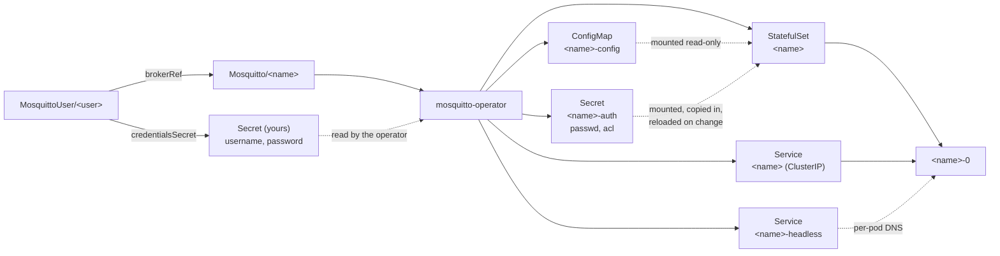

# Mosquitto Operator

[](https://github.com/guided-traffic/mosquitto-operator/actions)
[](https://github.com/guided-traffic/mosquitto-operator)
[](https://goreportcard.com/report/github.com/guided-traffic/mosquitto-operator)
[](LICENSE)

A Kubernetes operator that turns one `Mosquitto` custom resource into an
[Eclipse Mosquitto](https://mosquitto.org/) deployment, and `MosquittoUser` resources into the
clients it accepts: a StatefulSet of broker pods, a ConfigMap carrying the generated
`mosquitto.conf`, a Secret carrying the rendered users, a headless Service that gives every pod a
DNS name, and a ClusterIP Service in front of all of them — with optional per-pod persistence,
optional pod anti-affinity and an optional TLS listener. **The broker requires a login**: each
client is a `MosquittoUser` whose username and password live in its own Secret — the same Secret
the client application reads — with its own read and write rights per topic, and a new user, a
changed password or a removed one reaches the running broker without a restart. It is built to be
run from Git through Flux
([ADR 0012](docs/adr/0012-the-first-release-is-one-broker-run-from-git-and-high-availability-is-parked.md)).

The broker pods are **independent Mosquitto processes behind one Service**: there is no bridging
between them, no shared session state, no shared retained messages and no clustering. Raising
`spec.replicas` buys process redundancy, not a highly available broker. High availability is
parked until every other part of the plan is built.


```mermaid
flowchart LR
  CR["Mosquitto/&lt;name&gt;"] --> OP[mosquitto-operator]
  U["MosquittoUser/&lt;user&gt;"] -- "brokerRef" --> CR
  U -- "credentialsSecret" --> US["Secret (yours)<br/>username, password"]
  US -. "read by the operator" .-> OP
  OP --> AS["Secret<br/>&lt;name&gt;-auth<br/>passwd, acl"]
  OP --> CM["ConfigMap<br/>&lt;name&gt;-config"]
  OP --> STS["StatefulSet<br/>&lt;name&gt;"]
  OP --> HS["Service<br/>&lt;name&gt;-headless"]
  OP --> CS["Service<br/>&lt;name&gt; (ClusterIP)"]
  CM -. "mounted read-only" .-> STS
  AS -. "mounted, copied in,<br/>reloaded on change" .-> STS
  STS --> P0["&lt;name&gt;-0"]
  CS --> P0
  HS -. "per-pod DNS" .-> P0
```

Every claim in this document was verified by reading this repository. The E2E suite in
[`test/e2e/`](test/e2e/) exercises the provisioning path on a Kind cluster on every pull request
and before every release; Kind is the only cluster this operator has been observed on. Commands
below are transcribed from the code and from that suite; the ones that need no cluster were
executed while writing this file.

## ✨ Key Features

- 🔑 **A broker that requires a login** — no anonymous access, no opt-in to it; the generated listener loads the `password-file` and `acl-file` plugins and binds the client ID to the username, so no client can take over another's session.
- 👤 **One `MosquittoUser` per client** — it names its broker, its own credentials Secret (a `kubernetes.io/basic-auth` Secret works as it is) and its ACL: `read`, `write` or `readwrite` per topic filter. Topics under `$` are refused.
- ♻️ **Changes apply themselves** — a new user, a changed password, a removed user or a changed ACL reaches the running broker through a copy and a `SIGHUP`, without a restart; a removed user's open connections are dropped.
- 🧂 **Hashes only** — passwords are rendered as `$7$` PBKDF2-SHA512 into one Secret per broker, `<name>-auth`; a hash is kept while its password still verifies, so an unchanged pass changes nothing.
- 🩺 **Status Flux can read** — every `Mosquitto` and every `MosquittoUser` reports `observedGeneration` and a `Ready` condition with a reason; a user applied before its Secret or its broker becomes `Ready` when they arrive, and one user's failure never fails the broker or another user.
- 🧾 **Generated `mosquitto.conf`** — logging to stdout, persistence into `/mosquitto/data/`, one listener, and your own tuning from `spec.config`, checked line by line against an allowlist of tuning directives.
- 🔎 **Typos stop before the broker starts** — an init container runs the broker's own `--test-config` on the generated file and fails with the broker's message, file and line.
- 🔐 **Optional MQTTS** — `spec.tls.secretName` mounts an existing `tls.crt`/`tls.key` Secret and moves the listener to 8883. The operator consumes TLS material; it never issues or renews it.
- 💾 **Optional persistence** — `spec.storage` renders a `data` PVC template; without it the persistence directory is an `emptyDir` at the same path.
- 🧭 **Opt-in anti-affinity** — `off` (default), `soft` (scheduler preference) or `hard` (one broker pod per node, surplus pods stay `Pending`), over `kubernetes.io/hostname`.
- 🏷 **Pod labels and annotations from the resource** — `spec.podLabels` and `spec.podAnnotations` reach the broker pods, under the operator's own keys; a key removed from the resource leaves the pods.
- 🛡 **Never adopts what it does not own** — an existing ConfigMap, Secret, Service or StatefulSet under a managed name is refused, not overwritten, and reported on the resource.
- 🗑 **No delete verb** — the ClusterRole grants none, so teardown runs entirely through owner references and the garbage collector.
- 🔒 **Hardened broker pods** — every container non-root as uid/gid 1883, read-only root filesystem, all capabilities dropped, `seccompProfile: RuntimeDefault`, no ServiceAccount token mounted; an API server's own PodSecurity admission at `restricted` judges every shape in the test suite.
- 📦 **Two install paths, one authority** — Helm chart and `kustomize build config/default`, each with the same switches for the Secret grant; [`make verify-rbac-parity`](Makefile) compares what they actually render.

## 📛 Naming conventions

Everything below is derived deterministically from the resource. For a `Mosquitto` named
`<name>` in namespace `<ns>`:

### Objects

| Object | Name | Defined in |
|---|---|---|
| StatefulSet | `<name>` | [`common.StatefulSetName`](internal/common/labels.go) |
| Headless Service | `<name>-headless` | [`common.HeadlessServiceName`](internal/common/labels.go) |
| Client Service (ClusterIP) | `<name>` | [`common.ClientServiceName`](internal/common/labels.go) |
| ConfigMap | `<name>-config` | [`builder.ConfigMapName`](internal/builder/configmap.go) |
| ConfigMap key | `mosquitto.conf` | [`builder.ConfigKey`](internal/builder/configmap.go) |
| Rendered credentials Secret | `<name>-auth`, keys `passwd` and `acl` | [`common.AuthSecretName`](internal/common/labels.go), [`auth.PasswdKey`, `ACLKey`](internal/auth/files.go) |
| Containers | `mosquitto` (the broker, the default for `kubectl logs` and `exec`), `reloader` | [`builder.BrokerContainerName`, `ReloaderContainerName`](internal/builder/statefulset.go) |
| Init containers, in order | `auth-init`, `config-check` | [`builder.AuthInitContainerName`, `ConfigCheckContainerName`](internal/builder/statefulset.go) |
| Volumes | `config`, `auth-secret` (the `<name>-auth` Secret), `auth` (an `emptyDir` with the broker's copy), `tls` (only with `spec.tls`), `data`, `config-check-scratch` (an `emptyDir` the init container sees at the persistence path) | [`builder.ConfigVolumeName`, `AuthSecretVolumeName`, `AuthVolumeName`, `TLSVolumeName`, `DataVolumeName`, `ConfigCheckScratchVolumeName`](internal/builder/statefulset.go) |
| PVC template (only with `spec.storage`) | `data` | [`builder.DataVolumeName`](internal/builder/statefulset.go) |

Kubernetes derives two more names from those, by its own StatefulSet rules rather than by
anything in this repository: the pods are `<name>-0 … <name>-(replicas-1)`, and a PVC template
named `data` produces `data-<name>-<ordinal>`.

### Addresses

| What | Address | Port |
|---|---|---|
| Client Service | `<name>.<ns>.svc.cluster.local` | `1883`, or `8883` with `spec.tls` |
| One specific pod | `<name>-<ordinal>.<name>-headless.<ns>.svc.cluster.local` | same |

Both follow from the Service names above and from `spec.serviceName: <name>-headless` on the
StatefulSet; the cluster domain is whatever the cluster uses, `cluster.local` by default.

### Ports and paths

| Thing | Value | Defined in |
|---|---|---|
| Plain MQTT port / port name | `1883` / `mqtt` | [`builder.MQTTPort`, `MQTTPortName`](internal/builder/configmap.go) |
| MQTTS port / port name | `8883` / `mqtts` | [`builder.MQTTSPort`, `MQTTSPortName`](internal/builder/configmap.go) |
| Config mount | `/mosquitto/config` (read-only) | [`builder.ConfigMountPath`](internal/builder/configmap.go) |
| TLS mount | `/mosquitto/tls` (read-only) | [`builder.TLSMountPath`](internal/builder/configmap.go) |
| Data mount / persistence location | `/mosquitto/data` | [`builder.DataMountPath`](internal/builder/configmap.go) |
| The broker's credentials, copied | `/mosquitto/auth/passwd`, `/mosquitto/auth/acl` (read-only for the broker, `1883:1883` mode `0600`) | [`builder.AuthMountPath`](internal/builder/configmap.go) |
| The `<name>-auth` Secret mount | `/mosquitto/auth-secret` (`auth-init` and `reloader` only, mode `0440`) | [`builder.AuthSecretMountPath`](internal/builder/statefulset.go) |
| Plugins loaded | `/usr/lib/mosquitto_password_file.so` as `pwfile`, `/usr/lib/mosquitto_acl_file.so` as `aclfile` | [`builder.PasswordPluginPath`, `ACLPluginPath`](internal/builder/configmap.go) |
| Expected Secret keys | `tls.crt`, `tls.key` | [`builder.TLSCertKey`, `TLSKeyKey`](internal/builder/configmap.go) |
| Broker command | `/usr/sbin/mosquitto -c /mosquitto/config/mosquitto.conf` | [`buildBrokerContainer`](internal/builder/statefulset.go) |
| Config-check command | `/usr/sbin/mosquitto -c /mosquitto/config/mosquitto.conf --test-config` | [`buildConfigCheckContainer`](internal/builder/statefulset.go) |
| `auth-init` / `reloader` command | `/app/manager reload --source /mosquitto/auth-secret --target /mosquitto/auth` (`--once` for `auth-init`), in the operator's own image | [`buildReloadContainer`](internal/builder/statefulset.go) |

Exactly one container port is declared: `mqtt` or `mqtts`, never both. Enabling TLS **moves**
the generated listener rather than adding one.

### Labels and annotations

| Key | Value | On |
|---|---|---|
| `app.kubernetes.io/name` | `mosquitto` | every created object, and in every selector |
| `app.kubernetes.io/instance` | `<name>` | every created object, and in every selector |
| `app.kubernetes.io/managed-by` | `mosquitto-operator` | every created object, and in every selector |
| `app.kubernetes.io/component` | `broker` | every created object (**not** in selectors) |
| `app.kubernetes.io/version` | the image tag, or `latest` when the image carries none | every created object (**not** in selectors) |
| `mko.gtrfc.com/pod-spec-hash` | 8 hex digits over the built pod spec | the pod template |
| `mko.gtrfc.com/config-hash` | 8 hex digits over the generated `mosquitto.conf` | the pod template |
| `mko.gtrfc.com/applied-pod-labels` | the keys of `spec.podLabels` last written, sorted, comma-separated | the StatefulSet object |
| `mko.gtrfc.com/applied-pod-annotations` | the keys of `spec.podAnnotations` last written, sorted, comma-separated | the StatefulSet object |
| `kubectl.kubernetes.io/default-container` | `mosquitto` | the pod template |
| `mko.gtrfc.com/consumable` | `true` | a TLS or credentials Secret **you** label, the consent `secretSecurity: true` requires ([`mkov1.ConsumableLabel`](api/v1/mosquitto_types.go)) |

The pod template carries `spec.podLabels` and `spec.podAnnotations` too, under the keys above: a
key the operator sets always wins. Labels and annotations other tools add to any of the objects
are kept on every update.
The selector deliberately omits `component` and `version`
([`common.SelectorLabels`](internal/common/labels.go)): a selector carrying the image tag
would stop matching the running pods exactly when the image changes and the Service has to
keep routing.

How the two hashes carry a change into running pods:
[runtime.md](docs/operations/runtime.md#which-changes-restart-the-broker-pods).

### Operator install

| Object | Helm (`helm install mosquitto-operator …`) | kustomize (`config/default`) |
|---|---|---|
| Deployment | `mosquitto-operator` | `mosquitto-operator-mosquitto-operator` |
| ServiceAccount | `mosquitto-operator` | `mosquitto-operator-mosquitto-operator` |
| ClusterRole | `mosquitto-operator` | `mosquitto-operator-mosquitto-operator-role` |
| ClusterRoleBinding | `mosquitto-operator` | `mosquitto-operator-mosquitto-operator` |
| Leader-election Role / RoleBinding | `mosquitto-operator-leader-election` | `mosquitto-operator-mosquitto-operator-leader-election` |
| Secret-grant Role / RoleBinding per namespace (mode `namespaces` only) | `mosquitto-operator-secrets` in each namespace of `secretAccess.namespaces` | `mosquitto-operator-secrets`, one copy of [`secret-role.yaml`](config/components/secret-namespaces/secret-role.yaml) per namespace |
| Metrics Service | `mosquitto-operator-metrics` | *(none — the kustomize path renders no Service)* |
| Namespace | whatever `--namespace` says | `mosquitto-operator-system` (fixed in [`config/default/kustomization.yaml`](config/default/kustomization.yaml)) |

The kustomize names repeat themselves because `config/default` sets
`namePrefix: mosquitto-operator-` over resources already named `mosquitto-operator`. The
Helm names above are for the release name `mosquitto-operator`; another release name changes
them through the chart's `fullname` template. The **names** differ between the two paths, the
**rules** do not — that is what `make verify-rbac-parity` compares.

| Thing | Value |
|---|---|
| API group / version / kinds | `mko.gtrfc.com` / `v1` / `Mosquitto`, `MosquittoUser` |
| Resources / short names | `mosquittoes` / `mq`, `mosquittousers` / `mqu` |
| CRDs | `mosquittoes.mko.gtrfc.com`, `mosquittousers.mko.gtrfc.com` |
| ClusterRole name from the markers | `mosquitto-operator-role` |
| Leader-election Lease | `mosquitto-operator.mko.gtrfc.com`, in the operator's namespace |
| Operator image | `guidedtraffic/mosquitto-operator`; also the image of `auth-init` and `reloader` in every broker pod |
| Default broker image | `eclipse-mosquitto:2.1.2-alpine` |

## 📚 Documentation

| Document | What it covers |
|---|---|
| [docs/operations/](docs/operations/README.md) | Installing through Helm or kustomize, upgrading and uninstalling, and what happens at runtime — what rolls the brokers, what the status means |
| [docs/security/](docs/security/README.md) | The security architecture, one page per perspective — trust boundaries, credentials, tenancy, the privilege footprint, validation, rotation — each ending with what it does **not** cover |
| [SECURITY.md](SECURITY.md) | How to report a vulnerability |
| [docs/developer/](docs/developer/README.md) | Contributing: repository layout, per-package responsibilities, the reconcile pipeline, the test tiers, the build/test/lint matrix, CI and release, extension checklists, and what the pinned broker image measurably does |
| [docs/adr/](docs/adr/README.md) | Architecture Decision Records — what was decided, why, what was rejected and what it costs, and which decisions are not built yet |
| [docs/planning/project-plan.md](docs/planning/project-plan.md) | The plan for the next release: users, permissions and credentials that follow every change, run from Git through Flux |
| [Full reference](#-full-reference) (below) | Every `spec` field, its default and its effect |
| [Eclipse Mosquitto documentation](https://mosquitto.org/documentation/) | Upstream broker behaviour and every `mosquitto.conf` option `spec.config` can carry |
| [cert-manager](https://cert-manager.io/docs/) | Optional, and never installed by this project — one of the two ways to fill the Secret `spec.tls.secretName` names |

Read [docs/security/](docs/security/README.md) before granting anyone
`create mosquittoes`: the generated broker accepts anonymous clients, the operator holds a
cluster-wide grant, and whoever may write a `Mosquitto` in a namespace can read every Secret of
that namespace unless the operator runs with `secretSecurity: true`
([H-15](docs/security/trust-boundaries.md#h-15)).

## 🚀 TL;DR fast start

**Prerequisites.** A Kubernetes cluster, `kubectl`, and Helm 3. CI provisions Kind nodes at
`kindest/node:v1.33.4` ([`.github/workflows/release.yml`](.github/workflows/release.yml)) and
the integration tier runs against envtest `1.29.0` ([`Makefile`](Makefile)); no minimum server
version has been established beyond that, and the client libraries are `k8s.io/* v0.37.0`.

**1. Know what you grant, then install the operator.**

**The default install gives the operator read and write access to every Secret in every
namespace of the cluster** (`secretAccess.mode: all`): it reads the credentials Secrets the
`MosquittoUser` objects name, and writes one rendered Secret per broker. Whoever controls the
operator's ServiceAccount, image or process can then read and overwrite any Secret of the
cluster — in a Flux cluster that includes the deploy keys and the SOPS key. To confine it to the
namespaces your brokers live in, install with `--set secretAccess.mode=namespaces --set
'secretAccess.namespaces={home}'` instead
([ADR 0014](docs/adr/0014-credentials-reach-the-broker-as-one-rendered-secret-and-a-signal-never-as-a-restart.md) D7).

**Decide `secretSecurity` too.** With the default `false`, a `Mosquitto` may name any Secret of its
namespace as its TLS Secret, and a `MosquittoUser` any Secret as its credentials; because the
author of a `Mosquitto` also chooses the image that runs with its TLS Secret mounted, **whoever may
create or update a `Mosquitto` in a namespace may read every Secret of that namespace**. If your
cluster grants `mosquittoes` or `mosquittousers` more widely than Secrets, install with `--set
secretSecurity=true`: a Secret is then used only when it carries the label
`mko.gtrfc.com/consumable=true` (ADR 0014 D10).

```bash
helm install mosquitto-operator deploy/helm/mosquitto-operator \
  --namespace mosquitto-operator-system \
  --create-namespace
```

The chart carries both CRDs, the ClusterRole, the leader-election Role and the Deployment, and
prints the Secret grant it installed. Which image a checked-out chart runs, the published chart
repository, and the kustomize path: [installation.md](docs/operations/installation.md#install-with-helm).

**2. Create a broker and a user.**

```yaml
apiVersion: mko.gtrfc.com/v1
kind: Mosquitto
metadata:
  name: broker
spec:
  replicas: 1
---
apiVersion: v1
kind: Secret
metadata:
  name: zigbee2mqtt-mqtt
type: kubernetes.io/basic-auth          # the keys a MosquittoUser reads by default
stringData:
  username: zigbee2mqtt
  password: change-me                   # example — in Git, encrypt it (SOPS)
---
apiVersion: mko.gtrfc.com/v1
kind: MosquittoUser
metadata:
  name: zigbee2mqtt
spec:
  brokerRef:
    name: broker
  credentialsSecret:
    name: zigbee2mqtt-mqtt
  acls:
    - topic: zigbee2mqtt/#
      access: readwrite
```

```bash
kubectl apply -f broker.yaml
```

The order does not matter: a user applied before its Secret or its broker reports what is missing
and becomes `Ready` when it arrives.

**3. Verify.**

```bash
kubectl get mq broker
kubectl get mqu zigbee2mqtt
```

The columns are the CRDs' printer columns (the values are an example, not a captured run):

```
NAME     REPLICAS   READY   PHASE   USERS   AGE
broker   1          1       Ready   1       30s

NAME          BROKER   USERNAME      READY   AGE
zigbee2mqtt   broker   zigbee2mqtt   True    30s
```

`PHASE=Ready` means the StatefulSet reports every requested pod ready — a TCP connect, not an MQTT
session. To prove the broker speaks MQTT and checks the login, publish a retained message as the
user and read it back with the client tools that ship in the broker image (this is what
[`test/e2e/mosquitto_test.go`](test/e2e/mosquitto_test.go) does):

```bash
kubectl exec broker-0 -- mosquitto_pub -h 127.0.0.1 -u zigbee2mqtt -P change-me -q 1 -r -t zigbee2mqtt/probe -m hello
kubectl exec broker-0 -- mosquitto_sub -h 127.0.0.1 -u zigbee2mqtt -P change-me -q 1 -t zigbee2mqtt/probe -C 1 -W 15
# hello
kubectl exec broker-0 -- mosquitto_pub -h 127.0.0.1 -t zigbee2mqtt/probe -m anonymous
# Connection error: Connection Refused: not authorised.
```

A user added, changed or removed later reaches the running broker without a restart, about a
minute after the change — the time the kubelet takes to refresh a mounted Secret
([users.md](docs/operations/users.md)). From another pod in the cluster, the address is
`broker.<namespace>.svc.cluster.local:1883`. The operator creates no LoadBalancer, NodePort or
Ingress, and no NetworkPolicy: every pod of the cluster can reach the broker and try a password.

**Upgrade, rollback and uninstall:** [installation.md](docs/operations/installation.md#upgrade).
**Upgrading from `0.1.x` makes every broker require a login**: anonymous clients are refused from
the first pass, and a `spec.config` line outside the allowlist stops that broker's updates until it
is fixed ([installation.md](docs/operations/installation.md#upgrading-from-01x)). **Uninstalling
the chart deletes the CRDs and with them every broker and user in the cluster**; claims created
from `spec.storage` stay ([installation.md](docs/operations/installation.md#uninstall)).

## 📖 Full reference

### The `Mosquitto` resource, fully populated

Every field of the API, with defaults marked. Defaults marked `# default` come from the CRD
schema in [`config/crd/bases/mko.gtrfc.com_mosquittoes.yaml`](config/crd/bases/mko.gtrfc.com_mosquittoes.yaml)
unless noted; `# example` values have no default and are shown at a realistic setting.

```yaml
apiVersion: mko.gtrfc.com/v1
kind: Mosquitto
metadata:
  name: broker
  namespace: default
spec:
  replicas: 1                             # default — minimum 1, maximum 9
  image: eclipse-mosquitto:2.1.2-alpine   # example — no schema default; this is the value the
                                          #   operator substitutes when the field is empty
  antiAffinity: "off"                     # default — one of "off", "soft", "hard"
  config: |                               # example — tuning only: every line must name a directive
    max_keepalive 120                     #   of the allowlist below, or the pass is refused
  tls:                                    # example — omitted means a plaintext listener on 1883
    secretName: broker-tls                # required inside tls, minimum length 1
  storage:                                # example — omitted means an emptyDir for /mosquitto/data
    size: 1Gi                             # required inside storage, minimum length 1
    storageClassName: standard            # example — omitted or empty uses the cluster default class
  resources:                              # example — omitted means no requests and no limits
    requests:
      cpu: 50m
      memory: 64Mi
    limits:
      cpu: 500m
      memory: 256Mi
  podLabels:                              # example — omitted means the operator's labels only
    network.example.com/mqtt-clients: allowed
  podAnnotations:                         # example — omitted means the two hash annotations only
    prometheus.io/scrape: "false"
```

### `spec`

| Field | Type | Default | Effect |
|---|---|---|---|
| `replicas` | `int32` | `1` | Broker pods in the StatefulSet. Schema-validated to 1…9. They are independent processes; see the note under the pitch. |
| `image` | `string` | *(empty → `eclipse-mosquitto:2.1.2-alpine`)* | The broker image. The fallback is [`builder.DefaultImage`](internal/builder/statefulset.go), pinned to the 2.x line and tracked by Renovate. **The supported line is 2.1.x**; the operator does not check the tag, and an image that does not know a generated directive stops in the `config-check` init container with the broker's own message ([ADR 0007](docs/adr/0007-one-broker-image-pin-and-why-not-the-openssl-tag.md) D9, D10). |
| `config` | `string` | *(empty)* | Tuning appended after everything the operator generates, **one allowlisted directive per line** ([below](#specconfig-the-allowlist)); blank lines and `#` comments pass. A line naming any other directive refuses the pass: `phase: Failed`, reason `ConfigDirectiveRefused`, the message naming the line, and nothing is written, so the running broker keeps its configuration. Values are not checked by the operator: the `config-check` init container runs the broker's `--test-config` on the whole file before the broker starts, so a bad value leaves the pod in `Init:Error` / `Init:CrashLoopBackOff` with the broker's message, file and line in `kubectl logs <pod> -c config-check`. |
| `antiAffinity` | `string` | `"off"` | `off` renders no affinity block at all; `soft` renders a preferred term with weight `100`; `hard` renders a required term. Topology key `kubernetes.io/hostname`, selector limited to this resource's own pods. |
| `tls` | `object` | *(unset)* | Mounts an existing Secret and moves the listener to MQTTS. See [Two modes](#two-modes-and-what-each-one-protects). |
| `storage` | `object` | *(unset)* | Renders a `data` PVC template with access mode `ReadWriteOnce`. Unset means an `emptyDir` at the same mount path. |
| `resources` | `corev1.ResourceRequirements` | *(unset)* | Passed to the broker container unchanged — `requests`, `limits` and `claims`, the standard Kubernetes type — and to the `config-check` init container, which runs before the broker and therefore raises no request. `auth-init` and `reloader` carry fixed resources: requests `10m` CPU and `32Mi` memory, a `64Mi` memory limit. |
| `podLabels` | `map[string]string` | *(unset)* | Added to the broker pods' labels, under the operator's own: a key the operator sets (the selector labels, `app.kubernetes.io/component`, `app.kubernetes.io/version`) always wins, so a Service cannot be detached from its pods. A change rolls the pods; a key removed here is removed from the pods. Not put on the StatefulSet, the Services or the ConfigMap. |
| `podAnnotations` | `map[string]string` | *(unset)* | Added to the broker pods' annotations, under the operator's own: `mko.gtrfc.com/pod-spec-hash` and `mko.gtrfc.com/config-hash` always win, so a hash cannot be forged. A change rolls the pods; a key removed here is removed from the pods. |

`spec.antiAffinity: hard` guarantees the spread by refusing to place two broker pods of this
resource on one node, so replicas beyond the number of schedulable nodes stay `Pending`. Any
value outside the enum is treated as `off` ([`Mosquitto.AntiAffinityMode`](api/v1/mosquitto_types.go)),
which is the weakest setting rather than a guess.

**A digest-pinned `spec.image` works, and the version label is abbreviated.**
`app.kubernetes.io/version` is derived from the image reference
([`common.ExtractVersionFromImage`](internal/common/labels.go)), and a label value may not contain
a colon or exceed 63 bytes — which `sha256:<64 hex>` violates on both counts. The function
therefore reduces a digest to its 12-character hex prefix
(`repo@sha256:e3b0c44298fc1c14…` → `e3b0c44298fc`), sanitises anything else outside
`[A-Za-z0-9._-]`, truncates to 63 bytes, and falls back to `unknown` when nothing usable is left.
So the label identifies the image by eye without ever being a value the API server refuses.

### `spec.tls`

| Field | Type | Default | Effect |
|---|---|---|---|
| `secretName` | `string` | *(required)* | Name of a Secret **in the resource's own namespace** carrying `tls.crt` and `tls.key`. Minimum length 1; an empty value is treated as TLS off ([`Mosquitto.IsTLSEnabled`](api/v1/mosquitto_types.go)) so a half-filled spec cannot produce a listener with no certificate. |

With `secretSecurity: true` the Secret must also carry `mko.gtrfc.com/consumable=true`; one that
does not, or that does not exist, makes the resource `Failed` with reason `SecretNotConsumable`
or `SecretNotFound` and writes nothing — a running StatefulSet stays as it is. The label arriving
later wakes the broker through the operator's Secret watch. The operator reads the Secret's labels
through a metadata-only `get`; it never reads `tls.crt` or `tls.key`.

The operator neither creates nor renews that Secret. Filling it — by hand or through a
cert-manager `Certificate` the administrator owns:
[installation.md](docs/operations/installation.md#tls-for-the-brokers). **A renewed certificate
reaches running pods only when they restart**:
[runtime.md](docs/operations/runtime.md#a-renewed-certificate).

### `spec.storage`

| Field | Type | Default | Effect |
|---|---|---|---|
| `size` | `string` | *(required)* | PVC size, e.g. `1Gi`. An unparsable quantity fails the reconcile visibly instead of being silently replaced. |
| `storageClassName` | `string` | *(unset → cluster default class)* | Storage class for the PVC template. |

Changing `spec.storage` on an existing broker does **not** converge; the StatefulSet has to be
recreated by hand: [runtime.md](docs/operations/runtime.md#changing-specstorage-on-an-existing-broker).

### `status`

```yaml
status:
  phase: Ready
  readyReplicas: 1
  observedGeneration: 1
  users: 2
  conditions:
    - type: Ready
      status: "True"
      reason: AllReplicasReady
      message: 1/1 broker pods are ready
      observedGeneration: 1
      lastTransitionTime: "2026-10-05T12:00:00Z"   # example
    - type: Users
      status: "True"
      reason: UsersAccepted
      message: 2 users accepted
      observedGeneration: 1
      lastTransitionTime: "2026-10-05T12:00:00Z"   # example
```

| Field | Meaning |
|---|---|
| `phase` | Coarse rollout state, see below |
| `readyReplicas` | Mirrors the StatefulSet's ready replica count |
| `observedGeneration` | The `.metadata.generation` the operator last acted on |
| `users` | How many `MosquittoUser` objects are rendered into `<name>-auth`. `0` means the broker accepts nobody |
| `conditions` | `Ready` once one pass has completed; `Users` once a pass has rendered the users — `True` (`UsersAccepted`) with the count, `False` (`NoUsers`) when the broker accepts nobody. `Users` never changes `Ready`: a user's failure is the user's |

| Phase | Set when | `Ready` reason |
|---|---|---|
| `Pending` | The StatefulSet does not exist yet, or none of its pods are ready | `StatefulSetNotFound`, `NoReplicasReady` |
| `Progressing` | Some but not all requested pods are ready | `ReplicasNotReady` |
| `Ready` | Every requested pod is ready | `AllReplicasReady` |
| `Failed` | The operator could not write one of the objects it manages, or refused the pass before writing anything | `ReconcileFailed`; refusals: `ConfigDirectiveRefused` (a `spec.config` line outside the allowlist), `NamespaceNotGranted` (`secretAccess.mode: namespaces` does not list this namespace), `SecretNotConsumable`, `SecretNotFound` (`secretSecurity: true` and the TLS Secret) |

`Failed` describes the operator, not the brokers: pods that were already running keep running.
What each phase means in practice: [runtime.md](docs/operations/runtime.md#status).

### `spec.config`: the allowlist

`spec.config` takes **tuning only**
([ADR 0008](docs/adr/0008-the-generated-broker-is-anonymous-and-spec-config-can-undo-the-rest.md) D15):
a line whose first word is not one of the directives below refuses the whole pass. The list was
taken from `mosquitto.conf(5)` of the pinned `2.1.2` and every entry checked with that image's
`--test-config` ([broker-behaviour.md](docs/developer/broker-behaviour.md) M26);
[`builder.AllowedConfigDirectives`](internal/builder/config_allowlist.go) is the source.

<details>
<summary>The 26 allowed directives</summary>

| Kind | Directives |
|---|---|
| Limits | `global_max_clients`, `global_max_connections`, `max_connections`, `max_inflight_bytes`, `max_inflight_messages`, `max_packet_size`, `max_qos`, `max_topic_alias`, `max_topic_alias_broker`, `memory_limit`, `retain_available`, `upgrade_outgoing_qos` |
| Queues and sessions | `max_queued_bytes`, `max_queued_messages`, `queue_qos0_messages`, `persistent_client_expiration`, `retain_expiry_interval` |
| Keepalive and sockets | `max_keepalive`, `set_tcp_nodelay` |
| Persistence intervals | `autosave_interval`, `autosave_on_changes` |
| Logging and `$SYS` | `log_type`, `log_timestamp`, `log_timestamp_format`, `connection_messages`, `sys_interval` |

</details>

**Security:** nothing that opens a listener, loads a plugin, touches anonymous access or client
identity, bridges, or names a file is on the list — a second listener with
`listener_allow_anonymous true` would be an anonymous, ACL-free door beside the generated one
(M15). `max_connections`, `max_qos` and the two `max_topic_alias` directives are listener options
and apply to the generated listener, because `spec.config` follows it. A needed directive that is
missing costs an operator release.

### The `MosquittoUser` resource, fully populated

One client of one broker ([ADR 0013](docs/adr/0013-a-client-is-a-mosquittouser-with-its-credentials-in-its-own-secret.md)).
Everything it names lives in its own namespace: no reference carries a namespace field, so a
reference across namespaces cannot be written. `v1` is unstable until operator release 1.0.0.

```yaml
apiVersion: mko.gtrfc.com/v1
kind: MosquittoUser
metadata:
  name: zigbee2mqtt
  namespace: home
spec:
  brokerRef:
    name: broker                    # required — a Mosquitto in this namespace
  credentialsSecret:
    name: zigbee2mqtt-mqtt          # required — a Secret in this namespace
    usernameKey: username           # default — the key of a kubernetes.io/basic-auth Secret
    passwordKey: password           # default
  acls:                             # example — omitted means the user logs in and reaches no topic
    - topic: zigbee2mqtt/#          # an MQTT topic filter; + and # are wildcards
      access: readwrite             # one of read, write, readwrite
    - topic: homeassistant/status
      access: read
status:
  observedGeneration: 1
  username: zigbee2mqtt             # read from the Secret; a username is not a credential
  conditions:
    - type: Ready
      status: "True"
      reason: Accepted
      message: rendered into the broker's credentials as "zigbee2mqtt"
      observedGeneration: 1
      lastTransitionTime: "2026-10-05T12:00:00Z"   # example
```

| Field | Type | Default | Effect |
|---|---|---|---|
| `brokerRef.name` | `string` | *(required)* | The `Mosquitto` of this namespace whose client this is. Changing it moves the user: it leaves the old broker's credentials and enters the new one's. |
| `credentialsSecret.name` | `string` | *(required)* | The Secret holding the username and the password. The client application can read the same Secret. **Security:** with `secretSecurity: false` any Secret of the namespace may be named, and the operator reads it. |
| `credentialsSecret.usernameKey` | `string` | `username` | The key of the MQTT username. Changing it, or the value under it, changes the login; renaming the `MosquittoUser` does not. |
| `credentialsSecret.passwordKey` | `string` | `password` | The key of the MQTT password, rendered as a `$7$` PBKDF2-SHA512 hash at 1000 iterations into `<broker>-auth`, never in plaintext. |
| `acls[].topic` | `string` | *(required)* | A topic filter, 1 to 1024 characters. **Refused:** a leading `$` (`$SYS`, `$CONTROL` belong to the broker and the operator), a control character, leading or trailing whitespace, and `#` or `+` that is not a whole level (`#` only last). The CRD refuses the first two at `kubectl apply`; the operator refuses all of them when it renders, as reason `TopicRefused`. At most 256 entries. |
| `acls[].access` | `string` | *(required)* | `read` (subscribe and receive), `write` (publish) or `readwrite`. A denied publish is dropped silently; a denied subscription delivers nothing. |

The username is checked when it is rendered, because it lives in the Secret: it must match
`^[A-Za-z0-9][A-Za-z0-9._@-]{0,127}$`, and the prefix `mko-` is reserved for the operator's own
principals, in any case. When two users of one broker resolve to the same username, the **oldest**
one — by creation time, then by name — keeps it and every other one is refused naming the holder,
so a new object can never take over a running client's identity.

| `Ready` reason | `status` | Means |
|---|---|---|
| `Accepted` | `True` | Rendered into `<broker>-auth`. The broker picks it up when the kubelet refreshes the mounted Secret, about a minute later ([users.md](docs/operations/users.md#how-long-a-change-takes)) |
| `BrokerNotFound` | `False` | No `Mosquitto` of `brokerRef.name` in this namespace |
| `SecretNotFound` | `False` | The credentials Secret does not exist |
| `KeyNotFound` | `False` | The Secret has no such username or password key |
| `PasswordEmpty` | `False` | The password is empty |
| `UsernameInvalid` | `False` | The username is outside the allowlist — a trailing newline from `echo` into a file is the usual cause |
| `UsernameReserved` | `False` | The username starts with `mko-` |
| `UsernameConflict` | `False` | An older user of the same broker holds the username; the message names it |
| `TopicRefused` | `False` | An ACL topic or access mode is refused; the message names it |
| `SecretNotConsumable` | `False` | `secretSecurity: true` and the Secret lacks `mko.gtrfc.com/consumable=true` |
| `NamespaceNotGranted` | `False` | `secretAccess.mode: namespaces` does not list this namespace |

A user's failure never changes its broker's phase or another user's condition. The printer columns
are `BROKER`, `USERNAME`, `READY` and `AGE`.

### The generated `mosquitto.conf`

This is the exact file for a resource with neither `spec.tls` nor `spec.config`, rendered from
[`builder.GenerateMosquittoConf`](internal/builder/configmap.go) while writing this document:

```conf
# Generated by mosquitto-operator. Edits are overwritten on the next reconcile;
# append your own directives through spec.config instead.

# Logging goes to the container log so kubectl logs is the single source.
log_dest stdout
log_type error
log_type warning
log_type notice
log_type information

# Persistence writes into the data mount, which is a PVC when spec.storage
# is set and an emptyDir otherwise.
persistence true
persistence_location /mosquitto/data/

# Users. The operator renders every MosquittoUser bound to this broker into
# these two files; the reloader sidecar copies a change in and reloads the
# broker without a restart. There is no anonymous access.
plugin_load pwfile /usr/lib/mosquitto_password_file.so
plugin_opt_password_file /mosquitto/auth/passwd
plugin_load aclfile /usr/lib/mosquitto_acl_file.so
plugin_opt_acl_file /mosquitto/auth/acl

# Plain MQTT listener.
listener 1883
listener_allow_anonymous false
# The client ID is the username: no client can take over another client's
# session, and one username holds one connection.
use_username_as_clientid true
plugin_use pwfile
plugin_use aclfile
```

With `spec.tls` set, the listener lines become:

```conf
# MQTTS listener. The certificate and key come from the secret named in
# spec.tls.secretName; the operator neither creates nor renews them.
listener 8883
certfile /mosquitto/tls/tls.crt
keyfile /mosquitto/tls/tls.key
```

and `spec.config`, when non-empty, is appended last under a
`# spec.config, appended after every line passed the allowlist.` marker.

### Two modes, and what each one protects

|  | Without `spec.tls` | With `spec.tls` |
|---|---|---|
| Listener | `listener 1883`, port name `mqtt` | `listener 8883`, port name `mqtts` |
| On the wire | Plaintext — passwords included | TLS, using the mounted `tls.crt` / `tls.key` |
| Broker identity | Not proven to anyone | Proven to clients that validate the certificate |
| Client identity | A username and password of a `MosquittoUser` | The same; no client certificate is required |
| Who may publish and subscribe | Each user on the topics of its ACL; nobody anonymous | The same |
| Certificate rotation | n/a | Only on pod restart; the operator does not watch the Secret's content |

**Every broker requires a login, and there is no switch to turn that off**
([ADR 0008](docs/adr/0008-the-generated-broker-is-anonymous-and-spec-config-can-undo-the-rest.md) D13).
The generated listener sets `listener_allow_anonymous false` and binds the `password-file` and
`acl-file` plugins, which read what the operator renders from the `MosquittoUser` objects; a broker
without users accepts nobody and says so in its `Users` condition. `use_username_as_clientid true`
makes the client ID the username, so no client can take over another client's session by guessing
its client ID — the cost is one connection per username (D14).

**Without TLS, passwords cross the network in plaintext.** The operator creates no NodePort,
LoadBalancer or Ingress, and no NetworkPolicy: every pod of the cluster can reach the broker's pod
IP, read what it sends there and try passwords against it, bounded by nothing but the login (D16).
A NetworkPolicy of your own against the selector labels `app.kubernetes.io/instance=<name>` and
`app.kubernetes.io/managed-by=mosquitto-operator` narrows who can connect;
[docs/operations/users.md](docs/operations/users.md#who-can-reach-the-broker) has one.

### Helm chart values

Defaults from [`deploy/helm/mosquitto-operator/values.yaml`](deploy/helm/mosquitto-operator/values.yaml).

| Value | Default | Effect |
|---|---|---|
| `replicaCount` | `1` | Operator Deployment replicas. More than one requires `leaderElection.enabled: true` to stay sane. |
| `image.repository` | `guidedtraffic/mosquitto-operator` | Operator image. |
| `image.tag` | `""` | Empty uses the chart's `appVersion`. |
| `image.pullPolicy` | `IfNotPresent` | |
| `imagePullSecrets` | `[]` | |
| `nameOverride` / `fullnameOverride` | `""` | Standard chart naming overrides. |
| `serviceAccount.create` | `true` | Create the operator ServiceAccount. |
| `serviceAccount.annotations` | `{}` | |
| `serviceAccount.name` | `""` | Empty uses the chart fullname (or `default` when `create: false`). |
| `podAnnotations` / `podLabels` | `{}` | Applied to the operator pod. |
| `resources` | requests `10m` / `256Mi`, limits `500m` / `512Mi` | Operator container resources. Broker resources come from `spec.resources` instead. |
| `nodeSelector` / `tolerations` / `affinity` | `{}` / `[]` / `{}` | Operator pod scheduling. Broker scheduling is `spec.antiAffinity`. |
| `maxConcurrentReconciles` | `4` | How many `Mosquitto` resources reconcile at once. Passes for one resource stay serialised at any value. |
| `leaderElection.enabled` | `true` | Passes `--leader-elect` and renders the namespaced leader-election `Role`/`RoleBinding`. With it off, neither is created. |
| `metrics.enabled` | `true` | Renders the metrics Service and passes `--metrics-bind-address=:8080`; `false` passes `0`, which is what controller-runtime reads as "do not start the metrics server". |
| `secretAccess.mode` | `all` | Where the operator may read and write Secrets. `all`: `get`, `list`, `watch`, `create`, `update` on `secrets` in the ClusterRole — every namespace. `namespaces`: the same verbs as a Role and RoleBinding `<fullname>-secrets` in each namespace of `secretAccess.namespaces`, none in the ClusterRole, and `--secret-namespaces` passed. **Security:** `all` makes a compromised operator a reader and writer of every Secret of the cluster; `NOTES.txt` prints the grant after the install ([TL;DR](#-tldr-fast-start)). On the kustomize path, `namespaces` is the component [`config/components/secret-namespaces`](config/components/secret-namespaces/kustomization.yaml). |
| `secretAccess.namespaces` | `[]` | The namespaces of mode `namespaces`; the chart refuses to render that mode with an empty list. A `Mosquitto` elsewhere is refused with reason `NamespaceNotGranted`. |
| `secretSecurity` | `false` | Passes `--secret-security`. `true` makes a `Mosquitto` use a TLS Secret, and a `MosquittoUser` a credentials Secret, only when it carries `mko.gtrfc.com/consumable=true`; it grants nothing of its own. **Security:** with `false`, whoever may write a `Mosquitto` or a `MosquittoUser` in a namespace may make the operator read every Secret there, and a `Mosquitto` author may mount any of them ([TL;DR](#-tldr-fast-start)). On the kustomize path the same switch is the component [`config/components/secret-security`](config/components/secret-security/kustomization.yaml). |

**Security note:** the metrics endpoint is plain HTTP with no authentication; `metrics.enabled:
false` closes the port, deleting the Service only hides the DNS name. What it serves, and that no
broker metrics exist yet ([ADR 0002](docs/adr/0002-the-metrics-exporter-is-written-here.md)):
[runtime.md](docs/operations/runtime.md#the-operators-ports-and-probes).

### Operator flags

From [`cmd/main.go`](cmd/main.go). The chart sets the first seven from the values above.

| Flag | Default | Effect |
|---|---|---|
| `--metrics-bind-address` | `:8080` | Metrics endpoint address; `0` disables the server. |
| `--health-probe-bind-address` | `:8081` | Serves `/healthz` and `/readyz`. |
| `--leader-elect` | `false` | Leader election under the Lease `mosquitto-operator.mko.gtrfc.com`. |
| `--max-concurrent-reconciles` | `4` | Concurrent reconciles across resources. |
| `--secret-security` | `false` | Use a TLS or credentials Secret only when it carries `mko.gtrfc.com/consumable=true`. The last occurrence on the command line wins. |
| `--secret-namespaces` | *(empty)* | Comma-separated namespaces the operator may touch Secrets in, matching the Roles the install granted; it caches Secrets there only and refuses a `Mosquitto` elsewhere. Empty: every namespace, through the ClusterRole. |
| `--reloader-image` | `guidedtraffic/mosquitto-operator:<version of this build>` | The image of `auth-init` and `reloader` in every broker pod — the operator's own. The chart passes its `image.repository:image.tag`; `config/default` copies the manager's image into it. Part of the pod spec, so **every operator release rolls every broker** ([ADR 0014](docs/adr/0014-credentials-reach-the-broker-as-one-rendered-secret-and-a-signal-never-as-a-restart.md) D6). |
| `--zap-*` | `Development: true` | The standard zap logging flags, e.g. `--zap-log-level=debug` as used by `make run`. `bindZapFlags` in [`cmd/main.go`](cmd/main.go) starts from `zap.Options{Development: true}`, so the shipped default is development-mode logging (console encoder, DEBUG level, stack traces from WARN) rather than controller-runtime's production default. |

### `manager reload`

The second entry point of the operator binary, run by `auth-init` and `reloader` in every broker
pod ([`internal/reloader`](internal/reloader/run.go)); nothing passes it to the operator itself.

| Flag | Default | Effect |
|---|---|---|
| `--source` | `/mosquitto/auth-secret` | The mount of `<name>-auth`, read through one resolved `..data` link |
| `--target` | `/mosquitto/auth` | Where the broker reads its copies; written through a temporary file and a rename, mode `0600` |
| `--files` | `passwd,acl` | The keys copied |
| `--once` | `false` | Copy and exit without signalling: `auth-init`, on every start of the pod |
| `--interval` | `2s` | How often the sidecar compares the mount with the copies |
| `--process` | `mosquitto` | The `/proc/<pid>/comm` name of the process that gets `SIGHUP` after a change |

## 🛠 Development

```bash
make help                     # every target with its one-line description
make build                    # gofmt, go vet, then bin/manager
make test-unit                # unit tier (envtest binaries are fetched on demand)
make test-integration         # controller tier against envtest 1.29.0
make lint gosec vuln cyclo    # golangci-lint, gosec, govulncheck, gocyclo
make generate-all             # regenerate CRD + DeepCopy and sync the chart; run after any api/v1 change
make verify-rbac-parity       # compare what Helm and kustomize actually grant (needs helm + kustomize)
make e2e-local                # Kind cluster, cert-manager, Helm install, full E2E suite
```

`make generate-all` must leave `git status` clean — CI fails the build otherwise, because a
stale checked-in CRD would ship in the chart while the Go types said something else.

[docs/developer/](docs/developer/README.md) has the repository layout, the reconcile pipeline,
the test tiers, the extension checklists and the CI/release process.

## License

Apache-2.0 — see [LICENSE](LICENSE).
