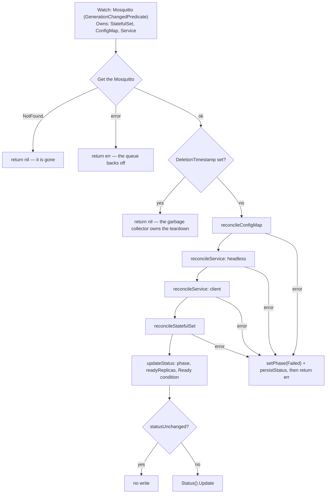

# Architecture

What runs where, what happens between `main()` and the first reconcile, what one pass does and
writes, how status is computed, and how a change reaches a running broker. Read against the tree
on 2026-10-05. Everything described here exists in the code; **none of it has been observed
running against a real cluster** — what is read from the code and what was measured is said where
it matters. What is not built is listed at the end. The decisions behind the shape are ADRs and
are linked, not restated.

## What runs where

```text
  operator namespace (chart: the release namespace; kustomize: mosquitto-operator-system)
  ┌───────────────────────────────────────────────────────────────┐
  │ Deployment, 1 replica, container "manager"                    │
  │   image: Containerfile -> distroless static-debian12:nonroot  │
  │   :8080 /metrics    controller-runtime's server, plain HTTP   │
  │   :8081 /healthz /readyz                                      │
  │   Lease mosquitto-operator.mko.gtrfc.com (with --leader-elect)│
  └───────────────────────────────┬───────────────────────────────┘
                                  │ watch Mosquitto; get/list/watch/create/update
                                  │ ConfigMap, Service, StatefulSet — every namespace
                                  ▼
                        Kubernetes API server ── StatefulSet controller, garbage collector,
                                  │                scheduler, kubelet (none of them this repo)
                                  ▼
  namespace of one Mosquitto <name>
  ┌──────────────────────────────────────────────────────────────────────────────┐
  │ ConfigMap  <name>-config ─────────── mounted read-only ──► /mosquitto/config  │
  │ Service    <name>-headless (None) ─┐                                          │
  │ Service    <name>          (ClusterIP) ─► pods <name>-0 … <name>-(replicas-1) │
  │ StatefulSet <name> ────────────────┘   container "mosquitto", uid/gid 1883    │
  │ Secret <spec.tls.secretName>  (the user's) ─ kubelet mounts ─► /mosquitto/tls │
  │ PVC template "data" (spec.storage) or emptyDir "data" ──────► /mosquitto/data │
  └──────────────────────────────────────────────────────────────────────────────┘
```

**The broker pods are independent Mosquitto processes behind one Service.** No bridging, no shared
sessions, no shared retained messages, no clustering: raising `spec.replicas` buys process
redundancy, not a highly available broker. A subscriber on one pod never sees a retained message
published through another. What the pinned image actually does is measured in
[broker-behaviour.md](broker-behaviour.md).

The operator itself never talks to a broker: it writes objects, and the StatefulSet controller and
the kubelet turn them into running pods. It holds no rule for `secrets` — the kubelet mounts the
TLS material. The security view of this picture is [docs/security/](../security/README.md).

## Operator startup

[`cmd/main.go`](../../cmd/main.go), `main()`:

1. `bindOperatorFlags` and `bindZapFlags` declare the flags on `flag.CommandLine`; `flag.Parse()`.
2. `ctrl.SetLogger(zap.New(zap.UseFlagOptions(...)))`, with `Development: true` as the base the
   zap flags modify. One `starting mosquitto-operator` line logs `version`, `commit`, `buildTime`.
3. `ctrl.NewManager(ctrl.GetConfigOrDie(), managerOptions(flags))` — the package scheme
   (client-go plus `mkov1`, registered in `init`), the metrics bind address, the probe bind
   address, leader election with ID `mosquitto-operator.mko.gtrfc.com` and no namespace, so the
   Lease lands in the namespace the operator runs in.
4. `newReconciler(mgr, flags).SetupWithManager(mgr)` — the watches below and the worker count.
5. `AddHealthzCheck("healthz", healthz.Ping)` and `AddReadyzCheck("readyz", healthz.Ping)`. Both
   are pings: the pod reports Ready as soon as the probe server answers, which says nothing about
   cache sync or leadership.
6. `mgr.Start(ctrl.SetupSignalHandler())`. With `--leader-elect`, the reconciler runs only once
   the Lease is held; without the leader-election `Role` the manager keeps retrying the Lease and
   never reconciles, while its pod stays Ready (the comment in
   [`config/manager/manager.yaml`](../../config/manager/manager.yaml) records this).

Every setup error, and an error returned by `mgr.Start`, exits the process with code 1;
`ctrl.GetConfigOrDie` exits on its own when no kubeconfig or in-cluster config is found.

## Watches and concurrency

`SetupWithManager` registers `For(&Mosquitto{})` with `predicate.GenerationChangedPredicate{}`,
and `Owns` on StatefulSet, ConfigMap and Service. The predicate keeps the operator's own status
writes — and any other status-only or metadata-only change of the CR — from waking it; changes to
the owned objects still arrive through the three `Owns` watches, which is how a StatefulSet's
readiness reaches `status.readyReplicas` at all. A change to the TLS Secret wakes nothing.

`MaxConcurrentReconciles` defaults to `DefaultMaxConcurrentReconciles = 4` (flag
`--max-concurrent-reconciles`, chart value `maxConcurrentReconciles`), not controller-runtime's 1,
because a single worker couples every `Mosquitto` in the cluster to the slowest pass. Passes for the
*same* resource stay serialised at any value — the work queue never runs two passes for one key.
A reconciler built with zero, as every test builds it, also gets 4 (`maxConcurrentReconciles`).

## The reconcile pipeline



[`internal/controller/mosquitto_controller.go`](../../internal/controller/mosquitto_controller.go),
step by step, with what the code shape does not say:

1. **A missing resource is not an error.** `apierrors.IsNotFound` returns `ctrl.Result{}, nil`.
2. **A resource being deleted gets no writes at all.** There is no finalizer. The controller
   references make the garbage collector delete every managed object, and writing them again
   during deletion would race that collection
   ([ADR 0009](../adr/0009-delete-only-through-owner-references.md)).
3. **Objects are written in dependency order** — ConfigMap, headless Service, client Service,
   StatefulSet — because the pods mount the ConfigMap and are addressed through the headless
   Service. The first failure stops the pass; nothing after it is written.
4. **Every write is create-or-converge, guarded by ownership.** `SetControllerReference` on the
   desired object, then `Get`, then `Create` on NotFound — otherwise `ensureOwned` before anything
   else. An existing object this `Mosquitto` does not control is refused, never adopted: a label is
   not a proof, `metav1.IsControlledBy` is. The guard matters most for Services, whose
   `spec.selector` is mutable, so nothing else stops the operator from pointing somebody else's
   Service at these pods. The refusal is a reconcile failure, because the resource cannot do its
   job without the object.
5. **The StatefulSet diff compares hashes, not the pod spec** (below). A structural comparison
   against the stored object would report a difference on every pass — the API server defaults a
   long list of pod fields the operator never sets — and loop forever.
6. **`volumeClaimTemplates` are written on create and never updated.** They are immutable.
7. **Status is recomputed from the live StatefulSet and written only if it changed** — even though
   the predicate already filters status-only events, every write costs an API request and a
   `resourceVersion` bump that every informer in the cluster sees.

On a failed write, `Reconcile` sets `Failed` through `setPhase`, persists it (a failure to persist
is logged, not returned), and returns the original error so the work queue backs off.

## What one pass writes

| Object | Name | Built by |
|---|---|---|
| ConfigMap | `<name>-config`, one key `mosquitto.conf` | `builder.BuildConfigMap` |
| Headless Service | `<name>-headless`, `ClusterIP: None`, `publishNotReadyAddresses: true` | `builder.BuildHeadlessService` |
| Client Service | `<name>`, ClusterIP | `builder.BuildClientService` |
| StatefulSet | `<name>`, `serviceName: <name>-headless` | `builder.BuildStatefulSet` |
| PVC template | `data`, `ReadWriteOnce`, only when `spec.storage.size` is set | `buildVolumeClaimTemplates` |

The single listener moves rather than multiplies: `BrokerPort` returns `8883`/`mqtts` when
`IsTLSEnabled()` and `1883`/`mqtt` otherwise, the container declares exactly that one port, and
both Services target it *by name*. That is a statement about the generated block only —
`spec.config` is appended unparsed and can declare further listeners the operator neither models
nor exposes ([ADR 0008](../adr/0008-the-generated-broker-is-anonymous-and-spec-config-can-undo-the-rest.md)).

## What each write compares

| Kind | Drift when | An update writes |
|---|---|---|
| ConfigMap | `Data` differs (`equality.Semantic.DeepEqual`), or a desired label is missing or different | `Data`, `Labels` |
| Service | `Spec.Ports` or `Spec.Selector` differ, or a desired label is missing or different | `Spec.Ports`, `Spec.Selector`, `Labels` |
| StatefulSet | `builder.StatefulSetHasChanged`: replica count, object labels, template labels, or one of the two hash annotations on the template | `Spec.Replicas`, `Spec.Template`, `Labels` |

Labels other parties add are not drift — `MapEntriesMissing` ignores extra keys. They are not kept
either: an update sets `Labels` to the desired set, so a foreign label survives until the operator
updates the object for a reason of its own. The same holds for `Spec.Template`, which an update
replaces whole, including annotations somebody else put on it.

`StatefulSetHasChanged` treats a nil replica count on either side as no drift
(`TestStatefulSetHasChanged_NilReplicasIsNotDrift`). The pod-spec hash covers the whole pod spec the
builder produces, so a new field **inside** the pod template is picked up automatically; a new
field **outside** it — on the StatefulSet spec — is not compared and does not converge until it is
added to `StatefulSetHasChanged` and to the update.

## Status

Written by `updateStatus` and `setPhase`. `phase`, `observedGeneration` and the single `Ready`
condition are always written together, so they cannot disagree about which generation they
describe.

| Condition in `updateStatus` | Phase | `Ready` | Reason | Message |
|---|---|---|---|---|
| StatefulSet missing | `Pending` | `False` | `StatefulSetNotFound` | `Waiting for the StatefulSet to be created` |
| `spec.replicas > 0` and `readyReplicas >= spec.replicas` | `Ready` | `True` | `AllReplicasReady` | `<ready>/<replicas> broker pods are ready` |
| `readyReplicas > 0`, fewer than requested | `Progressing` | `False` | `ReplicasNotReady` | `<ready>/<replicas> broker pods are ready` |
| `readyReplicas == 0` | `Pending` | `False` | `NoReplicasReady` | `0/<replicas> broker pods are ready` |
| any write in `reconcileResources` failed | `Failed` | `False` | `ReconcileFailed` | the error text |

`readyReplicas` mirrors the StatefulSet's `status.readyReplicas`, which counts pods whose
readiness probe passes — a TCP connect to the listener port, so "Ready" means "accepts TCP", not
"speaks MQTT". `Failed` describes the operator, not the brokers: pods that were already running
keep running. `statusUnchanged` compares phase, `readyReplicas`, `observedGeneration` and the
conditions with `reflect.DeepEqual`; because `meta.SetStatusCondition` keeps
`lastTransitionTime` when the status does not change, a pass that changes nothing writes nothing.

## How a change reaches a running broker

Mosquitto reads its configuration once at startup, and a ConfigMap update restarts nothing. The
`mko.gtrfc.com/config-hash` annotation on the pod template is what turns a configuration change
into a rollout; `mko.gtrfc.com/pod-spec-hash` does the same for anything else the builder puts
into the pod spec. Both are FNV-32a digests (`hashOf`), used to detect change, never to prove
identity.

| Change | What the operator writes | What happens to the pods |
|---|---|---|
| `spec.config` | ConfigMap data; the config hash on the template | the StatefulSet controller rolls them |
| `spec.image`, `spec.resources`, `spec.antiAffinity` | the template (pod-spec hash); for the image also the version label on every object | rolled |
| `spec.tls` switched on or off | ConfigMap (listener, cert paths), both Services' port, the template (volume, mount, port, probes) | rolled |
| another `spec.tls.secretName` | the template (the secret volume) | rolled |
| `spec.replicas` | `spec.replicas` of the StatefulSet only | scaled; nothing rolls (`TestReplicaChangeDoesNotRollThePods`) |
| the content of the TLS Secret | nothing — the Secret is not watched | keep serving the old material until they restart, e.g. `kubectl rollout restart statefulset/<name>` ([ADR 0001](../adr/0001-the-operator-consumes-tls-material-it-never-issues-it.md)) |
| `spec.storage.size` or `storageClassName` | nothing that converges — `volumeClaimTemplates` are never updated | unchanged; the StatefulSet has to be recreated by hand |
| `spec.storage` added or removed | the template changes (the `emptyDir` named `data` disappears or appears) while the claim templates stay as created | not verified: what the API server answers to that update has not been observed |

## The broker pod

Built by `buildPodSpec` and `buildBrokerContainer` in
[`statefulset.go`](../../internal/builder/statefulset.go):

- **Identity and hardening.** `runAsNonRoot`, uid/gid `1883` and `fsGroup: 1883` (the `mosquitto`
  user of the image; the `fsGroup` is what lets the broker write a root-owned PVC),
  `readOnlyRootFilesystem`, `allowPrivilegeEscalation: false`, every capability dropped, the
  `RuntimeDefault` seccomp profile at pod level, and `automountServiceAccountToken: false` because
  the broker issues no API calls. `TestBuildStatefulSet_SatisfiesRestrictedPodSecurityStandard`
  holds this to the restricted Pod Security Standard.
- **Command.** `/usr/sbin/mosquitto -c /mosquitto/config/mosquitto.conf`, bypassing the image's
  entrypoint, which chowns `/mosquitto` when it runs as root — which this pod never does. That the
  binary is still at that path is what `test/imagetools` checks against the pinned image.
- **Volumes.** `config` (the ConfigMap, mode `0644`, read-only mount), `tls` (the Secret, mode
  `0644`, read-only mount, only with TLS), `data` (`emptyDir` unless `spec.storage` is set, in
  which case the claim template of the same name). The `0644` is written out because it is what
  the API server defaults to, which keeps the pod-spec hash stable across passes.
- **Probes.** Both TCP on the listener port: readiness after 5 s every 5 s (timeout 3, failure
  threshold 3), liveness after 15 s every 10 s (timeout 5, failure threshold 5).
- **Anti-affinity.** `BuildPodAntiAffinity`: none for `off`, one preferred term at weight `100` for
  `soft`, one required term for `hard`; topology key `kubernetes.io/hostname`; the selector is
  `SelectorLabels`, so a second `Mosquitto` in the same namespace is not repelled.

## The generated mosquitto.conf

`GenerateMosquittoConf` emits, in order: logging to stdout (`error`, `warning`, `notice`,
`information`), `persistence true` with `persistence_location /mosquitto/data/`, exactly one
listener (`listener 1883`, or `listener 8883` with `certfile /mosquitto/tls/tls.crt` and
`keyfile /mosquitto/tls/tls.key`), `allow_anonymous true`, and then `spec.config` verbatim when it
is not blank. Because `spec.config` comes last, a repeated global option in it wins, and nothing in
it is validated — a file the broker rejects is a CrashLoopBackOff, not a rejected resource. Why the
broker is anonymous and what that leaves open is
[ADR 0008](../adr/0008-the-generated-broker-is-anonymous-and-spec-config-can-undo-the-rest.md).

## The operator's own metrics endpoint

`managerOptions` sets only `Metrics.BindAddress`: controller-runtime's metrics server on `:8080`,
plain HTTP, with no authentication or authorization filter. It serves controller-runtime's own
series; nothing in this repository registers a metric (`prometheus/client_golang` is in
[`go.mod`](../../go.mod) only as an indirect dependency). The chart starts it under
`metrics.enabled` (default `true`) and passes `--metrics-bind-address=0`, controller-runtime's
"off", otherwise. Who can reach it is a security question, answered in
[docs/security/](../security/README.md).

## Where the decisions live

| Decision | Where it lives in code | ADR |
|---|---|---|
| The operator consumes TLS material and never issues it; a rotation needs a pod restart | `MosquittoTLS`, the secret volume in `statefulset.go`, the TLS branch of `GenerateMosquittoConf` | [0001](../adr/0001-the-operator-consumes-tls-material-it-never-issues-it.md) |
| The broker metrics exporter is to be written here, as a sidecar — **nothing of it is implemented** | nothing; `cmd/` holds only `main.go` and `main_test.go` | [0002](../adr/0002-the-metrics-exporter-is-written-here.md) |
| The Go version is one fact in four files, moved by one grouped Renovate PR | `go.mod`, `Containerfile`, `GO_VERSION` in both workflows, `.github/release-template.hbs` | [0003](../adr/0003-the-go-version-is-one-fact-in-four-files.md) |
| Two E2E legs on a node-count axis, no version matrix, a gate job for the required check | the commented-out `e2e-tests` and `e2e-gate` jobs in `release.yml`, `KIND_WORKERS` in the Makefile | [0004](../adr/0004-two-e2e-legs-and-no-version-matrix.md) |
| Fork pull requests execute on the self-hosted runners, gated outside the repository | the comment above `on:` in `release.yml`; no fork guard in any workflow | [0005](../adr/0005-fork-pull-requests-execute-on-the-self-hosted-runners.md) |
| Both install paths grant the same authority, proven by rendering both | `test/rbacparity`, `config/rbac/`, `deploy/helm/.../templates/clusterrole.yaml` and `leader-election.yaml` | [0006](../adr/0006-both-install-paths-grant-the-same-authority.md) |
| One broker image pin, `2.1.2-alpine`, never an `-openssl` tag | `builder.DefaultImage`, `testimages.MosquittoImage`, the `eclipse-mosquitto` packageRule | [0007](../adr/0007-one-broker-image-pin-and-why-not-the-openssl-tag.md) |
| The generated broker accepts anonymous clients, and `spec.config` is appended last | `GenerateMosquittoConf` | [0008](../adr/0008-the-generated-broker-is-anonymous-and-spec-config-can-undo-the-rest.md) |
| Delete only through owner references; no `delete` and no `patch` in the ClusterRole | the RBAC markers, `ensureOwned`, the deletion check in `Reconcile` | [0009](../adr/0009-delete-only-through-owner-references.md) |
| A check is not a check until it has failed on purpose | `hack/*.mjs`, the E2E guard grep, the dirty-tree guards, the empty-render assertions in `test/rbacparity` | [0010](../adr/0010-a-check-is-not-a-check-until-it-has-failed-on-purpose.md) |

Two choices live only in code comments, with no ADR: `DefaultMaxConcurrentReconciles = 4`
([above](#watches-and-concurrency)) and the broker pod's security context
([above](#the-broker-pod)).

## What is not built

Not in the tree, and not to be described as if it were: the broker metrics exporter
(`cmd/exporter` does not exist; [ADR 0002](../adr/0002-the-metrics-exporter-is-written-here.md)
records the decision only), authentication and ACLs in the API (`spec.config` is where they go
today), admission webhooks, PodDisruptionBudgets, NetworkPolicies, ServiceMonitor,
PrometheusRule, any watch on the TLS Secret, and any cert-manager dependency at any layer. The
chart has no template for any of them.
