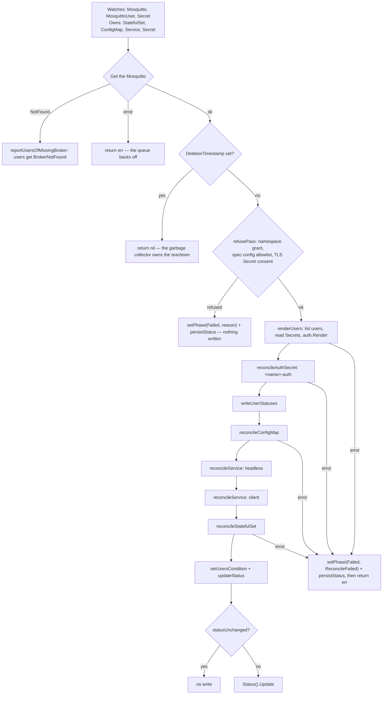

# Architecture

What runs where, what happens between `main()` and the first reconcile, what one pass does and
writes, how status is computed, and how a change reaches a running broker. Read against the tree
on 2026-10-05. Everything described here exists in the code, and the E2E suite runs it on Kind —
the only cluster it has been observed on; what is read from the code and what was measured is said
where it matters. What is not built is listed at the end. The decisions behind the shape are ADRs and
are linked, not restated.

## What runs where

```text
  operator namespace (chart: the release namespace; kustomize: mosquitto-operator-system)
  ┌───────────────────────────────────────────────────────────────┐
  │ Deployment, 1 replica, container "manager"                    │
  │   image: Containerfile -> distroless static-debian12:nonroot  │
  │   :8080 /metrics    controller-runtime's server, plain HTTP   │
  │   :8081 /healthz /readyz                                      │
  │   Lease mosquitto-operator.mko.gtrfc.com (with --leader-elect)│
  └───────────────────────────────┬───────────────────────────────┘
                                  │ watch Mosquitto, MosquittoUser, Secret (data stripped);
                                  │ get/list/watch/create/update ConfigMap, Service,
                                  │ StatefulSet, Secret — every namespace (Secrets: or listed)
                                  ▼
                        Kubernetes API server ── StatefulSet controller, garbage collector,
                                  │                scheduler, kubelet (none of them this repo)
                                  ▼
  namespace of one Mosquitto <name>
  ┌──────────────────────────────────────────────────────────────────────────────┐
  │ MosquittoUser <u> ─► Secret <creds> (the user's; read by the operator)       │
  │ Secret     <name>-auth ── mounted ─► auth-init / reloader ─► /mosquitto/auth  │
  │ ConfigMap  <name>-config ─────────── mounted read-only ──► /mosquitto/config  │
  │ Service    <name>-headless (None) ─┐                                          │
  │ Service    <name>          (ClusterIP) ─► pods <name>-0 … <name>-(replicas-1) │
  │ StatefulSet <name> ────────────────┘   "mosquitto" + "reloader", uid 1883     │
  │ Secret <spec.tls.secretName>  (the user's) ─ kubelet mounts ─► /mosquitto/tls │
  │ PVC template "data" (spec.storage) or emptyDir "data" ──────► /mosquitto/data │
  └──────────────────────────────────────────────────────────────────────────────┘
```

**The broker pods are independent Mosquitto processes behind one Service.** No bridging, no shared
sessions, no shared retained messages, no clustering: raising `spec.replicas` buys process
redundancy, not a highly available broker. A subscriber on one pod never sees a retained message
published through another. What the pinned image actually does is measured in
[broker-behaviour.md](broker-behaviour.md).

The operator itself never talks to a broker: it writes objects, and the StatefulSet controller and
the kubelet turn them into running pods. It reads the users' credentials Secrets — through a cache
that strips Secret data, and one uncached `get` per user when it renders — and writes
`<name>-auth`; inside the pod, `auth-init` and `reloader`, the second entry point of the same
binary, carry that Secret to the broker without a restart
([the credentials path](#the-credentials-path)). It never reads the TLS Secret's data; with
`--secret-security=true` it reads its labels through a metadata-only `get` before writing anything
(`refuseTLSSecret`). The security view of this picture is [docs/security/](../security/README.md).

## Operator startup

[`cmd/main.go`](../../cmd/main.go), `main()`:

0. `os.Args[1] == "reload"` runs `reloader.Main` instead and exits with its code: the entry point
   of `auth-init` and `reloader` in the broker pods ([below](#the-credentials-path)).
1. `bindOperatorFlags` and `bindZapFlags` declare the flags on `flag.CommandLine`; `flag.Parse()`.
2. `ctrl.SetLogger(zap.New(zap.UseFlagOptions(...)))`, with `Development: true` as the base the
   zap flags modify. One `starting mosquitto-operator` line logs `version`, `commit`, `buildTime`.
3. `ctrl.NewManager(ctrl.GetConfigOrDie(), managerOptions(flags))` — the package scheme
   (client-go plus `mkov1`, registered in `init`), the metrics bind address, the probe bind
   address, leader election with ID `mosquitto-operator.mko.gtrfc.com` and no namespace, so the
   Lease lands in the namespace the operator runs in, and the Secret cache: `ByObject` for
   `corev1.Secret` with `controller.StripSecret` as its transform and, with
   `--secret-namespaces`, the listed namespaces only.
4. `newReconciler(mgr, flags).SetupWithManager(mgr)` — the field indexes, the watches below and the
   worker count. The reconciler gets `mgr.GetAPIReader()`, `--reloader-image` and the namespace
   list.
5. `AddHealthzCheck("healthz", healthz.Ping)` and `AddReadyzCheck("readyz", healthz.Ping)`. Both
   are pings: the pod reports Ready as soon as the probe server answers, which says nothing about
   cache sync or leadership.
6. `mgr.Start(ctrl.SetupSignalHandler())`. With `--leader-elect`, the reconciler runs only once
   the Lease is held; without the leader-election `Role` the manager keeps retrying the Lease and
   never reconciles, while its pod stays Ready (the comment in
   [`config/manager/manager.yaml`](../../config/manager/manager.yaml) records this).

Every setup error, and an error returned by `mgr.Start`, exits the process with code 1;
`ctrl.GetConfigOrDie` exits on its own when no kubeconfig or in-cluster config is found.

## Watches and concurrency

`SetupWithManager` ([`watches.go`](../../internal/controller/watches.go)) registers three field
indexes — `MosquittoUser` by `spec.brokerRef.name` and by `spec.credentialsSecret.name`,
`Mosquitto` by `spec.tls.secretName` — and then:

| Watch | Predicate | Wakes |
|---|---|---|
| `For(&Mosquitto{})` | `GenerationChangedPredicate` | the resource |
| `Owns` StatefulSet, ConfigMap, Service, Secret | — | the owning `Mosquitto`; the Secret one is how a hand edit of `<name>-auth` is undone |
| `Watches(&MosquittoUser{}, userBrokers())` | `GenerationChangedPredicate` | the broker the user names, and on an update the one it named before, so a move leaves the old broker's credentials |
| `Watches(&Secret{}, brokersForSecret)` | — | the brokers whose users name the Secret, and those that name it as their TLS Secret |

The predicates keep the operator's own status writes — on a `Mosquitto` and on its users — from
waking it; changes to the owned objects still arrive through the `Owns` watches, which is how a
StatefulSet's readiness reaches `status.readyReplicas` at all. Together the watches are what lets a
user applied before its Secret or its broker converge without a manual step
(`TestIntegration_Users_ConvergeWhenTheirReferencesArrive`).

`MaxConcurrentReconciles` defaults to `DefaultMaxConcurrentReconciles = 4` (flag
`--max-concurrent-reconciles`, chart value `maxConcurrentReconciles`), not controller-runtime's 1,
because a single worker couples every `Mosquitto` in the cluster to the slowest pass. Passes for the
*same* resource stay serialised at any value — the work queue never runs two passes for one key.
A reconciler built with zero, as every test builds it, also gets 4 (`maxConcurrentReconciles`).

## The reconcile pipeline



[`internal/controller/`](../../internal/controller), step by step, with what the code shape does
not say:

1. **A missing resource is not an error**, but its users are told: every `MosquittoUser` naming it
   gets `Ready=False`, `BrokerNotFound`.
2. **A resource being deleted gets no writes at all.** There is no finalizer. The controller
   references make the garbage collector delete every managed object, and writing them again
   during deletion would race that collection
   ([ADR 0009](../adr/0009-delete-only-through-owner-references.md)).
3. **Three refusals come before any write** ([`refusals.go`](../../internal/controller/refusals.go)):
   a namespace outside `--secret-namespaces` (`NamespaceNotGranted`, also on every user), a
   `spec.config` line outside the allowlist (`ConfigDirectiveRefused`), and with
   `--secret-security` a TLS Secret without consent (`SecretNotConsumable`, `SecretNotFound`).
   Each sets `Failed` with its reason and returns without error, so nothing retries in a loop: a
   spec change or the Secret watch brings the next pass.
4. **The users are rendered next** ([`users.go`](../../internal/controller/users.go)). Each user's
   Secret is looked up in the cache (existence, labels — the cache holds no data), checked against
   `--secret-security`, then read with one uncached `get`; a missing Secret or key is that user's
   verdict, not an error of the pass. `auth.Render` gets the rest and the current `<name>-auth`
   data, whose hashes it keeps while their passwords verify ([the renderer](#the-renderer)).
   `<name>-auth` is written before the users' statuses, so `Ready=True` on a user means rendered.
5. **Objects are written in dependency order** — `<name>-auth`, ConfigMap, headless Service, client
   Service, StatefulSet — because the pods mount the Secret and the ConfigMap and are addressed
   through the headless Service. The first failure stops the pass; nothing after it is written.
6. **Every write is create-or-converge, guarded by ownership.** `SetControllerReference` on the
   desired object, then `Get`, then `Create` on NotFound — otherwise `ensureOwned` before anything
   else. An existing object this `Mosquitto` does not control is refused, never adopted: a label is
   not a proof, `metav1.IsControlledBy` is. The guard matters most for Services, whose
   `spec.selector` is mutable, and for `<name>-auth`, which the pods load as their credentials.
   The refusal is a reconcile failure, because the resource cannot do its job without the object.
7. **The StatefulSet diff compares hashes, not the pod spec** (below). A structural comparison
   against the stored object would report a difference on every pass — the API server defaults a
   long list of pod fields the operator never sets — and loop forever.
8. **`volumeClaimTemplates` are written on create and never updated.** They are immutable.
9. **Status is recomputed from the live StatefulSet and the rendered users and written only if it
   changed** — even though the predicate already filters status-only events, every write costs an
   API request and a `resourceVersion` bump that every informer in the cluster sees.

On a failed write, `Reconcile` sets `Failed` through `setPhase`, persists it (a failure to persist
is logged, not returned), and returns the original error so the work queue backs off.

## What one pass writes

| Object | Name | Built by |
|---|---|---|
| Secret | `<name>-auth`, keys `passwd` and `acl` | `builder.BuildAuthSecret` from `auth.Render` |
| ConfigMap | `<name>-config`, one key `mosquitto.conf` | `builder.BuildConfigMap` |
| Headless Service | `<name>-headless`, `ClusterIP: None`, `publishNotReadyAddresses: true` | `builder.BuildHeadlessService` |
| Client Service | `<name>`, ClusterIP | `builder.BuildClientService` |
| StatefulSet | `<name>`, `serviceName: <name>-headless` | `builder.BuildStatefulSet` |
| PVC template | `data`, `ReadWriteOnce`, only when `spec.storage.size` is set | `buildVolumeClaimTemplates` |

The single listener moves rather than multiplies: `BrokerPort` returns `8883`/`mqtts` when
`IsTLSEnabled()` and `1883`/`mqtt` otherwise, the container declares exactly that one port, and
both Services target it *by name*. That is a statement about the generated block only —
`spec.config` is appended unparsed and can declare further listeners the operator neither models
nor exposes ([ADR 0008](../adr/0008-the-generated-broker-is-anonymous-and-spec-config-can-undo-the-rest.md)).

## What each write compares

| Kind | Drift when | An update writes |
|---|---|---|
| Secret `<name>-auth` | `Data` differs, read uncached, or a desired label is missing or different | `Data`; `Labels` merged |
| ConfigMap | `Data` differs (`equality.Semantic.DeepEqual`), or a desired label is missing or different | `Data`; `Labels` merged (`common.MergeLabels`) |
| Service | `Spec.Ports` or `Spec.Selector` differ, or a desired label is missing or different | `Spec.Ports`, `Spec.Selector`; `Labels` merged |
| StatefulSet | `builder.StatefulSetHasChanged`: replica count, or a desired key missing or different among the object labels, the object annotations (the applied-keys records), the template labels (`spec.podLabels` included) or the template annotations (the two hashes and `spec.podAnnotations`) | `builder.MergeStatefulSet`: `Spec.Replicas` and the pod spec replaced; object and template labels and annotations merged |

Labels and annotations other parties add are not drift — `MapEntriesMissing` ignores extra keys —
and they are kept: every update merges the operator's keys over the live ones, its values winning
([ADR 0009](../adr/0009-delete-only-through-owner-references.md) D9). The one removal is
`MergeStatefulSet`'s: the StatefulSet carries `mko.gtrfc.com/applied-pod-labels` and
`mko.gtrfc.com/applied-pod-annotations`, the sorted keys of `spec.podLabels` and
`spec.podAnnotations` it last applied, and a key that one of those lists and the desired list no
longer does is deleted from the template before the merge (`common.RemovedKeys`). Because the
desired StatefulSet always carries both annotations, an emptied map still changes their value and
so still counts as drift; a StatefulSet written before they existed reads as "nothing applied".

`StatefulSetHasChanged` treats a nil replica count on either side as no drift
(`TestStatefulSetHasChanged_NilReplicasIsNotDrift`). The pod-spec hash covers the whole pod spec the
builder produces, so a new field **inside** the pod template is picked up automatically; a new
field **outside** it — on the StatefulSet spec — is not compared and does not converge until it is
added to `StatefulSetHasChanged` and to the update.

## Status

Written by `updateStatus`, `setPhase` and `setUsersCondition`. `phase`, `observedGeneration` and
the `Ready` condition are always written together, so they cannot disagree about which generation
they describe; `users` and the `Users` condition (`UsersAccepted` with the count, `NoUsers` at
zero) are set from the rendered users on a pass that got that far, and never touch `Ready`
([ADR 0012](../adr/0012-the-first-release-is-one-broker-run-from-git-and-high-availability-is-parked.md)
D6). A user's status — `observedGeneration`, `username` and one `Ready` condition with its reason —
is written by `persistUserStatus` in the same pass, only when it changed.

| Condition in `updateStatus` | Phase | `Ready` | Reason | Message |
|---|---|---|---|---|
| StatefulSet missing | `Pending` | `False` | `StatefulSetNotFound` | `Waiting for the StatefulSet to be created` |
| `spec.replicas > 0` and `readyReplicas >= spec.replicas` | `Ready` | `True` | `AllReplicasReady` | `<ready>/<replicas> broker pods are ready` |
| `readyReplicas > 0`, fewer than requested | `Progressing` | `False` | `ReplicasNotReady` | `<ready>/<replicas> broker pods are ready` |
| `readyReplicas == 0` | `Pending` | `False` | `NoReplicasReady` | `0/<replicas> broker pods are ready` |
| any read or write in `reconcileResources` failed, or the metadata read of `refuseTLSSecret` | `Failed` | `False` | `ReconcileFailed` | the error text |
| a refusal of `refusePass`, before any write: the namespace grant, the `spec.config` allowlist, the TLS Secret's consent | `Failed` | `False` | `NamespaceNotGranted`, `ConfigDirectiveRefused`, `SecretNotFound` / `SecretNotConsumable` | names the setting, the line, or the Secret and the label |

`readyReplicas` mirrors the StatefulSet's `status.readyReplicas`, which counts pods whose
readiness probe passes — a TCP connect to the listener port, so "Ready" means "accepts TCP", not
"speaks MQTT". `Failed` describes the operator, not the brokers: pods that were already running
keep running. `statusUnchanged` compares phase, `readyReplicas`, `observedGeneration`, `users` and
the conditions with `reflect.DeepEqual`; because `meta.SetStatusCondition` keeps
`lastTransitionTime` when the status does not change, a pass that changes nothing writes nothing.

## How a change reaches a running broker

Mosquitto reads its configuration once at startup, and a ConfigMap update restarts nothing. The
`mko.gtrfc.com/config-hash` annotation on the pod template is what turns a configuration change
into a rollout; `mko.gtrfc.com/pod-spec-hash` does the same for anything else the builder puts
into the pod spec. Both are FNV-32a digests (`hashOf`), used to detect change, never to prove
identity.

| Change | What the operator writes | What happens to the pods |
|---|---|---|
| `spec.config` | ConfigMap data; the config hash on the template | the StatefulSet controller rolls them |
| `spec.image`, `spec.resources`, `spec.antiAffinity` | the template (pod-spec hash); for the image also the version label on every object | rolled |
| `spec.tls` switched on or off | ConfigMap (listener, cert paths), both Services' port, the template (volume, mount, port, probes) | rolled |
| another `spec.tls.secretName` | the template (the secret volume) | rolled |
| `spec.replicas` | `spec.replicas` of the StatefulSet only | scaled; nothing rolls (`TestReplicaChangeDoesNotRollThePods`) |
| `spec.podLabels`, `spec.podAnnotations` | the template's labels or annotations, the applied-keys annotation of the object | rolled; a removed key leaves the template |
| the content of the TLS Secret | nothing — the operator never reads it | keep serving the old material until they restart, e.g. `kubectl rollout restart statefulset/<name>` ([ADR 0001](../adr/0001-the-operator-consumes-tls-material-it-never-issues-it.md)) |
| a `MosquittoUser` or its Secret | `<name>-auth` | not restarted: the reloader copies the change in and signals ([the credentials path](#the-credentials-path)) |
| a new operator version, i.e. `--reloader-image` | the template (the image of `auth-init` and `reloader`) | rolled, every broker |
| `spec.storage.size` or `storageClassName` | nothing that converges — `volumeClaimTemplates` are never updated | unchanged; the StatefulSet has to be recreated by hand |
| `spec.storage` added or removed | the template changes (the `emptyDir` named `data` disappears or appears) while the claim templates stay as created | not verified: what the API server answers to that update has not been observed |

## The broker pod

Built by `buildPodSpec`, `buildConfigCheckContainer` and `buildBrokerContainer` in
[`statefulset.go`](../../internal/builder/statefulset.go):

- **Identity and hardening.** `runAsNonRoot`, uid/gid `1883` and `fsGroup: 1883` (the `mosquitto`
  user of the image; the `fsGroup` is what lets the broker write a root-owned PVC),
  `readOnlyRootFilesystem`, `allowPrivilegeEscalation: false`, every capability dropped, the
  `RuntimeDefault` seccomp profile at pod level, and `automountServiceAccountToken: false` because
  the broker issues no API calls. Every container gets the same `containerSecurityContext()`.
  `TestBuildStatefulSet_SatisfiesRestrictedPodSecurityStandard` spells the restricted Pod Security
  Standard out by hand, and `TestIntegration_PodSecurity_RestrictedAdmitsEveryShape` has an API
  server's PodSecurity admission judge the pod of every shape.
- **`auth-init` and `reloader`.** The operator's own image, `/app/manager reload`, between the
  `auth-secret` mount and the `auth` copy, with fixed requests (`10m`, `32Mi`) and a `64Mi` memory
  limit ([the credentials path](#the-credentials-path)). `auth-init` is the first init container,
  `reloader` the second container; `shareProcessNamespace: true` lets it signal the broker. The
  annotation `kubectl.kubernetes.io/default-container: mosquitto` keeps `kubectl logs` and `exec` on
  the broker.
- **The `config-check` init container.** The broker image runs
  `/usr/sbin/mosquitto -c /mosquitto/config/mosquitto.conf --test-config` before the broker starts,
  with the broker's resources and security context ([ADR 0007](../adr/0007-one-broker-image-pin-and-why-not-the-openssl-tag.md)
  D10). It mounts `config` read-only and `config-check-scratch`, an `emptyDir`, at
  `/mosquitto/data` — **never the `data` volume**: `--test-config` saves an empty database to the
  persistence path on exit, which would erase the broker's retained messages and sessions on every
  start ([broker-behaviour.md](broker-behaviour.md) M19). It opens no TLS file, so it needs no TLS
  mount.
- **Command.** `/usr/sbin/mosquitto -c /mosquitto/config/mosquitto.conf`, bypassing the image's
  entrypoint, which chowns `/mosquitto` when it runs as root — which this pod never does. That the
  binary is still at that path is what `test/imagetools` checks against the pinned image.
- **Volumes.** `config` (the ConfigMap, mode `0644`, read-only mount), `auth-secret` (`<name>-auth`,
  mode `0440`) and `auth` (an `emptyDir`, read-only in the broker), `tls` (the Secret, mode
  `0644`, read-only mount, only with TLS), `data` (`emptyDir` unless `spec.storage` is set, in
  which case the claim template of the same name), `config-check-scratch` (`emptyDir`, the init
  container's only). The `0644` is written out because it is what
  the API server defaults to, which keeps the pod-spec hash stable across passes.
- **Probes.** Both TCP on the listener port: readiness after 5 s every 5 s (timeout 3, failure
  threshold 3), liveness after 15 s every 10 s (timeout 5, failure threshold 5).
- **Metadata.** The template labels are `spec.podLabels` with `common.BaseLabels` written over
  them, the template annotations `spec.podAnnotations` with the two hash annotations written over
  them ([ADR 0012](../adr/0012-the-first-release-is-one-broker-run-from-git-and-high-availability-is-parked.md)
  D5); the StatefulSet object carries neither map.
- **Anti-affinity.** `BuildPodAntiAffinity`: none for `off`, one preferred term at weight `100` for
  `soft`, one required term for `hard`; topology key `kubernetes.io/hostname`; the selector is
  `SelectorLabels`, so a second `Mosquitto` in the same namespace is not repelled.

## The generated mosquitto.conf

`GenerateMosquittoConf` emits, in order: logging to stdout (`error`, `warning`, `notice`,
`information`); `persistence true` with `persistence_location /mosquitto/data/`; `plugin_load` of
the `password-file` and `acl-file` plugins as `pwfile` and `aclfile` with
`plugin_opt_password_file /mosquitto/auth/passwd` and `plugin_opt_acl_file /mosquitto/auth/acl`;
exactly one listener (`listener 1883`, or `listener 8883` with `certfile` and `keyfile`) with
`listener_allow_anonymous false`, `use_username_as_clientid true` and `plugin_use` for both; and then
`spec.config` when it is not blank — after `ValidateSpecConfig` accepted every line of it
([`config_allowlist.go`](../../internal/builder/config_allowlist.go)). A listener option in
`spec.config` therefore applies to the generated listener. The 2.1 plugin form, never
`password_file`/`acl_file`/`per_listener_settings`, which 2.1 deprecates and 3.0 removes
([ADR 0008](../adr/0008-the-generated-broker-is-anonymous-and-spec-config-can-undo-the-rest.md)
D13–D15, [ADR 0007](../adr/0007-one-broker-image-pin-and-why-not-the-openssl-tag.md) D7).
`TestImageAcceptsTheGeneratedConfiguration` runs the pinned image's `--test-config` over the file
of both shapes with every allowed directive appended.

## The renderer

[`internal/auth`](../../internal/auth) turns the users of one broker into its credentials
([ADR 0013](../adr/0013-a-client-is-a-mosquittouser-with-its-credentials-in-its-own-secret.md),
[ADR 0014](../adr/0014-credentials-reach-the-broker-as-one-rendered-secret-and-a-signal-never-as-a-restart.md) D3, D9).
`Render(payload, inputs, previous, random)`:

1. **checks** every input — username allowlist, the reserved `mko-` prefix in any case, a non-empty
   password, every ACL topic (`$`, control characters, surrounding whitespace, wildcards that are
   not whole levels) and access mode — and turns a failure into that user's verdict;
2. **resolves collisions** by age: per username the oldest input by creation time, then by object
   name, wins; the others get `UsernameConflict` naming the holder. No status is used as memory;
3. **hashes**: an existing hash from `payload.Hashes(previous)` is kept while `VerifyPassword`
   accepts the plaintext, otherwise `HashPassword` draws a new 64-byte salt from `random`;
4. **sorts** the accepted users by username and their ACL entries by topic and access, without
   duplicates, and hands them to `payload.Render`.

The payload is the mode-specific half behind one interface: `FilePayload` renders `passwd`
(`username:hash` lines) and `acl` (a `user` line and its `topic <access> <topic>` lines per user);
a later dynamic-security payload would be a second implementation of the same interface. Equal
logins render equal bytes whatever the order, names or creation times of the objects
(`TestRender_IsDeterministic`, observed failing without the final sort), which is what keeps an
unchanged pass from signalling the broker.

## The credentials path

From `<name>-auth` to the broker, without a restart
([ADR 0014](../adr/0014-credentials-reach-the-broker-as-one-rendered-secret-and-a-signal-never-as-a-restart.md) D4–D6):

1. The pod mounts `<name>-auth` whole, no `subPath`, as the volume `auth-secret` at
   `/mosquitto/auth-secret` (mode `0440`), in `auth-init` and `reloader` only. It is part of no pod
   hash, so a change rolls nothing.
2. **`auth-init`** runs `/app/manager reload --once`: `reloader.Sync` copies `passwd` and `acl`
   into the `emptyDir` `auth` at `/mosquitto/auth`, on **every** start, as the pod's uid and group
   `1883:1883`, mode `0600` (M6). The broker mounts `auth` read-only.
3. **`reloader`** runs `/app/manager reload` for the pod's lifetime: every two seconds `Sync` reads
   all files through **one resolved `..data` link** (the kubelet swaps it in one rename, M23),
   compares the bytes with the copies, writes a changed one to a temporary file in `auth` and
   renames it over the copy, then `FindProcess` looks up the process whose `/proc/<pid>/comm` is
   `mosquitto` — visible because the pod sets `shareProcessNamespace: true` — and sends it
   `SIGHUP`. A copy that could not be signalled yet stays pending and is signalled on a later
   round. Same uid, no capability: the kernel allows exactly that (M22).
4. The broker reloads both plugins' files: removed users and changed passwords are disconnected,
   ACLs apply per message (M14).

`auth-init` and `reloader` run the operator's own image (`--reloader-image`), so every operator
release rolls every broker — accepted in D6 for one build pipeline instead of two.

## The operator's own metrics endpoint

`managerOptions` sets only `Metrics.BindAddress`: controller-runtime's metrics server on `:8080`,
plain HTTP, with no authentication or authorization filter. It serves controller-runtime's own
series; nothing in this repository registers a metric (`prometheus/client_golang` is in
[`go.mod`](../../go.mod) only as an indirect dependency). The chart starts it under
`metrics.enabled` (default `true`) and passes `--metrics-bind-address=0`, controller-runtime's
"off", otherwise. Who can reach it is a security question, answered in
[docs/security/](../security/README.md).

## Where the decisions live

| Decision | Where it lives in code | ADR |
|---|---|---|
| The operator consumes TLS material and never issues it; a rotation needs a pod restart until the reload of D10 | `MosquittoTLS`, the secret volume in `statefulset.go`, the TLS branch of `GenerateMosquittoConf` | [0001](../adr/0001-the-operator-consumes-tls-material-it-never-issues-it.md) |
| The broker metrics exporter is to be written here — **nothing of it is implemented** | nothing; the reserved `mko-` prefix is the only part in the tree | [0002](../adr/0002-the-metrics-exporter-is-written-here.md) |
| The Go version is one fact in four files, moved by one grouped Renovate PR | `go.mod`, `Containerfile`, `GO_VERSION` in both workflows, `.github/release-template.hbs` | [0003](../adr/0003-the-go-version-is-one-fact-in-four-files.md) |
| Two E2E legs on a node-count axis, no version matrix, a gate job for the required check | the `e2e-tests` and `e2e-gate` jobs in `release.yml`, `KIND_WORKERS` in the Makefile | [0004](../adr/0004-two-e2e-legs-and-no-version-matrix.md) |
| Fork pull requests execute on the self-hosted runners, gated outside the repository | the comment above `on:` in `release.yml`; no fork guard in any workflow | [0005](../adr/0005-fork-pull-requests-execute-on-the-self-hosted-runners.md) |
| Both install paths grant the same authority, proven by rendering both | `test/rbacparity`, `config/rbac/`, `deploy/helm/.../templates/clusterrole.yaml` and `leader-election.yaml` | [0006](../adr/0006-both-install-paths-grant-the-same-authority.md) |
| One broker image pin, `2.1.2-alpine`, never an `-openssl` tag | `builder.DefaultImage`, `testimages.MosquittoImage`, the `eclipse-mosquitto` packageRule | [0007](../adr/0007-one-broker-image-pin-and-why-not-the-openssl-tag.md) |
| The generated broker requires a login, binds the client ID to the username, and `spec.config` takes an allowlist | `GenerateMosquittoConf`, `AllowedConfigDirectives`, `ValidateSpecConfig` | [0008](../adr/0008-the-generated-broker-is-anonymous-and-spec-config-can-undo-the-rest.md) |
| Delete only through owner references; no `delete` and no `patch` in the ClusterRole | the RBAC markers, `ensureOwned`, the deletion check in `Reconcile` | [0009](../adr/0009-delete-only-through-owner-references.md) |
| A client is a `MosquittoUser` with its credentials in its own Secret; checks, collisions, deterministic rendering | `api/v1/mosquittouser_types.go`, `internal/auth` | [0013](../adr/0013-a-client-is-a-mosquittouser-with-its-credentials-in-its-own-secret.md) |
| Credentials reach the broker as one rendered Secret and a signal; the operator reads Secrets under a mode | `users.go`, `BuildAuthSecret`, `internal/reloader`, the pod's `auth-init` and `reloader`, `--secret-namespaces`, `--secret-security` | [0014](../adr/0014-credentials-reach-the-broker-as-one-rendered-secret-and-a-signal-never-as-a-restart.md) |
| A check is not a check until it has failed on purpose | `hack/*.mjs`, the E2E guard grep, the dirty-tree guards, the empty-render assertions in `test/rbacparity` | [0010](../adr/0010-a-check-is-not-a-check-until-it-has-failed-on-purpose.md) |

Two choices live only in code comments, with no ADR: `DefaultMaxConcurrentReconciles = 4`
([above](#watches-and-concurrency)) and the broker pod's security context
([above](#the-broker-pod)).

## What is not built

Not in the tree, and not to be described as if it were: the broker metrics exporter
([ADR 0002](../adr/0002-the-metrics-exporter-is-written-here.md) records the decision only), the
reload of a renewed TLS certificate ([ADR 0001](../adr/0001-the-operator-consumes-tls-material-it-never-issues-it.md)
D10), roles or groups of users, the dynamic-security mode, admission webhooks,
PodDisruptionBudgets, NetworkPolicies, ServiceMonitor, PrometheusRule, and any cert-manager
dependency at any layer. The chart has no template for any of them.
